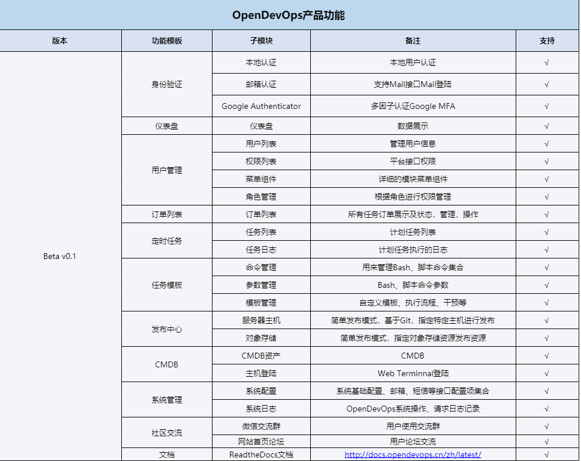
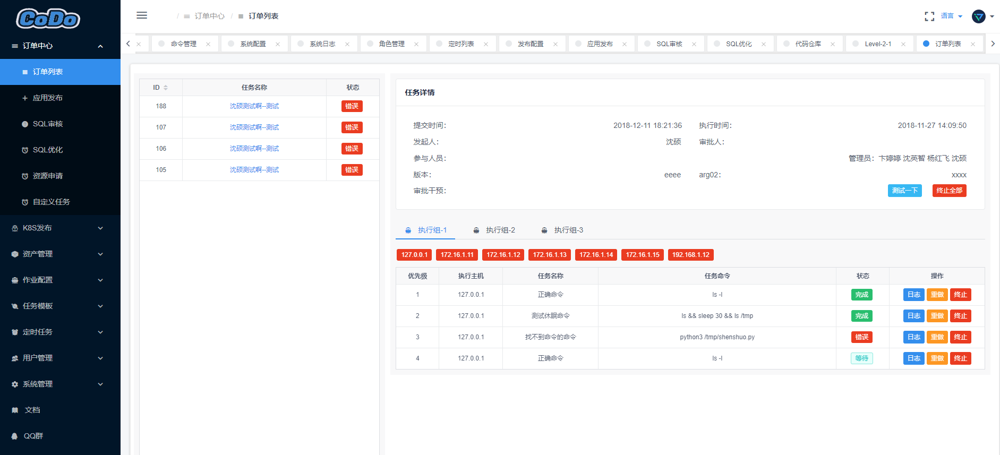

    

----
CoDo是一款为用户提供企业多混合云、自动化运维、完全开源的云管理平台。

Codo前端基于Vue iview开发、为用户提供友好的操作界面，增强用户体验。

Codo后端基于Python Tornado开发，其优势为轻量、简洁清晰、异步非阻塞。

CoDo开源多云管理平台为用户提供多功能：ITSM、基于RBAC权限系统、Web Terminnal登陆日志审计、录像回放、强大的作业调度系统、CMDB、监控报警系统等

众多功能模块我们一直在不停的调研和开发，如果你对此项目感兴趣可以加入我们的社区交流群，

同时也希望你能给我们项目一个star，为贡献者加油⛽️！为运维干杯🍻！

----

### 产品架构

### 产品功能

### Demo
我们提供了Demo供使用者体验，帮助你快速熟悉CoDo功能

`PS: 暂时还在调试权限中，不可登陆`
- 地址：http://demo.opendevops.cn/login
- 用户：codo
- 密码：codo

### 开始使用

我们提供多种部署文档，支持快速部署文档和一步步安装。

你也可以查阅我们完整的官方文档：http://docs.opendevops.cn/zh/latest/

- 一步步安装文档：[部署参考](http://docs.opendevops.cn/zh/latest/step_by_step_install.html)
- 快速安装部署文档：[部署参考](http://docs.opendevops.cn/zh/latest/docker_install.html) `暂未完成`

### 模块链接
> CodDo 项目我们是使用模块化、微服务化，以下为各个模块地址，同时也欢迎业界感兴趣各位大佬前来贡献

- 前端代码：[codo](https://github.com/opendevops-cn/codo)
- 管理后端：[codo-admin](https://github.com/opendevops-cn/codo-admin)
- 定时任务：[codo-cron](https://github.com/opendevops-cn/codo-cron)
- 任务调度：[codo-task](https://github.com/opendevops-cn/codo-task)
- 资产管理: [codo-cmdb](https://github.com/opendevops-cn/codo-cmdb)
- K8S发 布：[codo-k8s](https://github.com/opendevops-cn/codo-k8s)

### 感谢贡献者

感谢以下贡献着为Codo(CloudOpenDevOps)的贡献;  
感谢各位的付出，让维护因你们变的不再枯燥、世界因你们而美丽，此排名不分前后，谢谢大家!
  

|Name|Github Avatar|Name| GitHub Avatar                                                       | Name                                              | Github Avatar                                                       |
|---|---|---|---|---|---|
|[laoxu](https://github.com/rootman-xjj) |   | [shenshuo](https://github.com/ss1917)          |    |  [yangmingwei](https://github.com/yangmv)  |    |
|[yanghongfei](https://github.com/yanghongfei)           |    |[shengyingzhi](https://github.com/shenyingzhi) |    |  [biantingting](https://github.com/biantingting94)  |    |
|[zhirenyongnan](https://github.com/Aaronzryn) |  | [libo](https://github.com/alexbolee) |  |  |  |

## License

Everything is [GPL v3.0](https://www.gnu.org/licenses/gpl-3.0.html).
