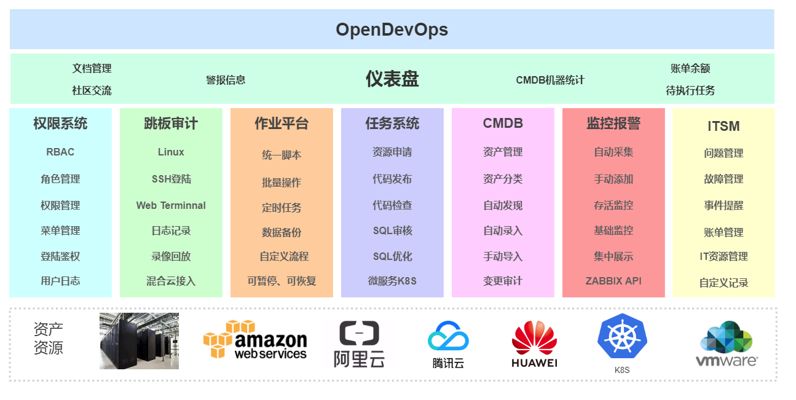
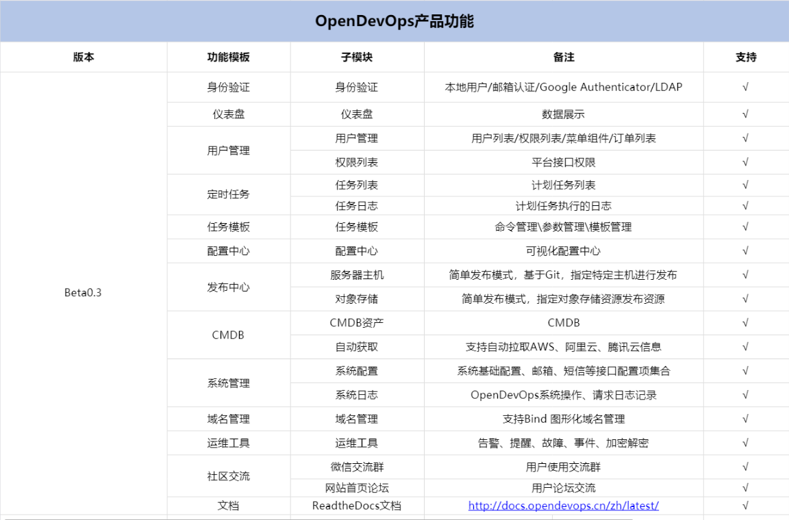

    

----

### 项目介绍

CODO 是一款专为企业设计的开源全球一站式运维平台，支持多混合云环境和自动化运维，为企业提供跨地域、跨云的统一管理能力。

### 技术架构与优势

- **前端**：基于 Vue + iView 和 React + Ant Design 开发，提供直观友好的操作界面，显著提升用户体验和工作效率。
- **后端**：采用 Python Tornado 和 Golang Gin，具备轻量级、简洁清晰和异步非阻塞的特点，实现高并发和快速响应。
- **微服务网关**：基于 OpenResty + Lua，提供统一的 API 网关和服务治理能力，其优势在于高性能、灵活扩展和优秀的负载均衡支持。
- **微前端基座**：基于阿里乾坤框架，负责统一纳管前端应用，支持微前端架构，具备模块化管理、动态加载及高效集成的能力。

### 项目亮点

- **高效统一管理**：支持跨地域、跨云环境，简化多云资源运维。
- **可观测与智能化**：全面覆盖实时监控、预警与性能分析。
- **强大自动化能力**：一站式自动化工具提升运维效率，降低操作复杂性。
- **云原生支持**：优化容器化与微服务管理，为企业数字化转型赋能。

众多功能模块我们一直在不停的调研和开发，如果你对此项目感兴趣可以加入我们的社区交流群，

同时也希望你能给我们项目一个，为贡献者加油⛽️！为运维干杯🍻！

----

### 语言

[English](README_EN.md) | [中文](README.md)

### 产品架构

### 产品功能

### Demo

我们提供了Demo供使用者体验,可点击Try Online Demo快速进行体验。

`PS: Demo权限正在调试中，目前Demo用户只有查看权限，且暂不开放用户列表,Demo订单日志我们暂时清空了`

- 地址：https://demo.opendevops.cn/user/login
- 用户：demo
- 密码：2ZbFYNv9WibWcR7GB6kcEY

### 开始使用

> 当前版本支持docker compose和kubernetes helm 一键快速部署。

- [Document](http://docs.opendevops.cn/)
- [Quick Experience](https://demo.opendevops.cn/user/login)
- [Deployment Document](https://github.com/opendevops-cn/codo-deploy-docs)

### 视频教程

> 视频会在业余时间持续录制，更多视频可以参考Up主空间：https://space.bilibili.com/388245257/

- [部署安装教程](https://www.bilibili.com/video/BV1BL4y1a7TU/)
- [快速了解视频](https://www.bilibili.com/video/BV1rp4y1v7fa/)
- [二次开发教程](https://www.bilibili.com/video/BV1Sy4y137md/)

### 模块链接

> CODO 项目我们是使用模块化、微服务化，以下为各个模块地址，同时也欢迎业界感兴趣各位大佬前来贡献

- 前端代码：[codo](https://github.com/opendevops-cn/codo)
- 管理后端：[codo-admin](https://github.com/opendevops-cn/codo-admin)
- 配置管理平台：[codo-cmdb](https://github.com/opendevops-cn/codo-cmdb)
- 任务调度：[codo-flow](https://github.com/opendevops-cn/codo-flow)
- 配置中心：[codo-kerrigan](https://github.com/opendevops-cn/kerrigan)
- 通知中心：[codo-notice](https://github.com/opendevops-cn/codo-notice)
- 灵云-kubernetes管理 ：[codo-cnmp](https://github.com/opendevops-cn/codo-cnmp)
- 管控中心 ：[codo-agent-server](https://github.com/opendevops-cn/codo-agent-server)
- 前端基座 ：[codo-home-index](https://github.com/opendevops-cn/codo-home-index)
- 天门网关 ：[codo-gateway](https://github.com/opendevops-cn/codo-gateway)

### 感谢贡献者

感谢以下贡献着为CODO(CloudOpenDevOps)的贡献;  
感谢各位的付出，让维护因你们变的不再枯燥、世界因你们而美丽，此排名不分前后，谢谢大家!

| Name                                          | Github Avatar                                                   | Name                                          | GitHub Avatar                                                    | Name                                              | Github Avatar                                                   |
|-----------------------------------------------|-----------------------------------------------------------------|-----------------------------------------------|------------------------------------------------------------------|---------------------------------------------------|-----------------------------------------------------------------|
| [laoxu](https://github.com/rootman-xjj)       |  | [shenshuo](https://github.com/ss1917)         |   | [laowang](https://github.com/cyancow)             |  |
| [yanghongfei](https://github.com/yanghongfei) |  | [shenyingzhi](https://github.com/shenyingzhi) |   | [biantingting](https://github.com/biantingting94) |  |
| [zhirenyongnan](https://github.com/Aaronzryn) |  | [libo](https://github.com/alexbolee)          |   | [liuchunyu](https://github.com/liuchunyu007)      |  |
| [ops-coffee](https://github.com/ops-coffee)   |  | [yangmingwei](https://github.com/yangmv)      |   | [punk](https://github.com/it-sos)                 |   |
| [radius2136](https://github.com/radius2136)   |  | [ccheers](https://github.com/ccheers)         |  | [Sean Chen](https://github.com/fengmengqiu)       |    |

**[⬆ 返回顶部](#产品架构)**

### QQ交流群

> 感兴趣的同学可以加入我们的QQ交流群,代码我们也会不断进行更新，感谢大家的支持。

-
一键加入QQ群：

- 扫描二维码加群

## License

Everything is [GPL v3.0](https://www.gnu.org/licenses/gpl-3.0.html).

### 友情链接

[运维咖啡吧 - 一杯咖啡轻松运维](https://blog.ops-coffee.cn/)

[WeRSS - 微信公众号订阅助手](https://github.com/rachelos/we-mp-rss)

## 写在最后

感谢以下同学为Demo环境进行赞助。

| Name                                              | Github Avatar                                                   | 贡献金额  |
|---------------------------------------------------|-----------------------------------------------------------------|-------|
| [shenshuo](https://github.com/ss1917)             |  | ￥500  |
| [laowang](https://github.com/cyancow)             |  | ￥300  |
| [ops-coffee](https://github.com/ops-coffee)       |  | ￥300  |
| [yanghongfei](https://github.com/yanghongfei)     |  | ￥300  |
| [panda-yo](https://github.com/panda-yo)           |  | ￥200  |
| [yanshuanglong](https://github.com/yanshuanglong) |  | ￥200  |
| [Victor](https://github.com/victor)               |      | ￥200  |
| [DsinV](https://github.com/ywl913)                |   | ￥200  |
| [lixiaozheng](https://github.com/si7eka)          |  | ￥200  |
| [pcghost](https://github.com/q48775533q/)         |  | ￥100  |
| [ca7dEm0n](https://github.com/ca7dEm0n)           |  | ￥100  |
| [jiangming](https://github.com/jiangming1)        |  | ￥100  |
| [金额共计](https://github.com/opendevops-cn)          |  | ￥2700 |
