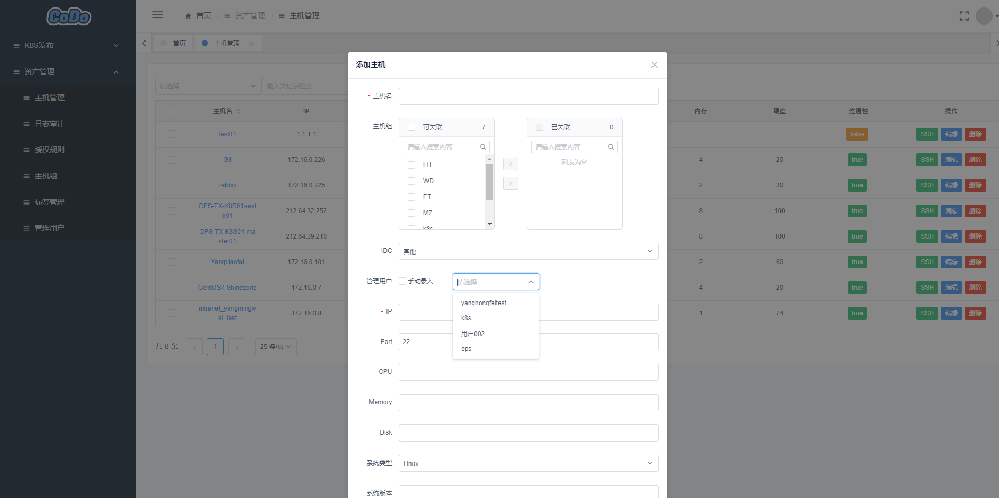

### 资产管理

> 这部分主要介绍CMDB资产管理，后续我们会进行调研开发更加详细功能。

#### 特色功能

- 支持单台/批量添加资产
- 支持批量推送/批量更新/批量删除
- 支持Web Terminal登陆，方便直接网页SSH登陆操作
- 支持用户权限授权，针对不同用户赋权不同资产/资产组
- 支持用户操作日志审计、录像回放功能，让操作有审计记录
- 支持标签管理、多个标签可以方便你快速的区分你的资产分类
- 支持管理用户、多管理用户选择可以解决你多云、多服务器、不同密钥主机连接问题

**添加主机**

这里只需要填写几个必填项即可，其余的后续都会自动获取到

- 主机名：服务器Hostname
- 主机组：选择关联你的主机组
- IDC： 机房位置
- 管理用户： 是用来登陆你机器的用户，Linux系统用户密码/密钥
- IP： 服务器的IP地址
- port: 服务器SSH端口
- Tag标签： 可关联标签
- Other: 其余的可以选择不填，自动获取

<!---->

