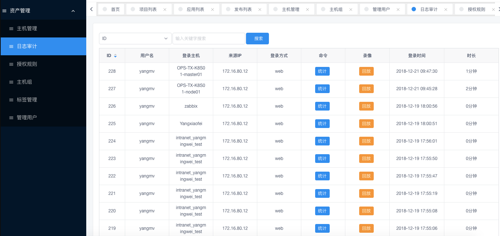
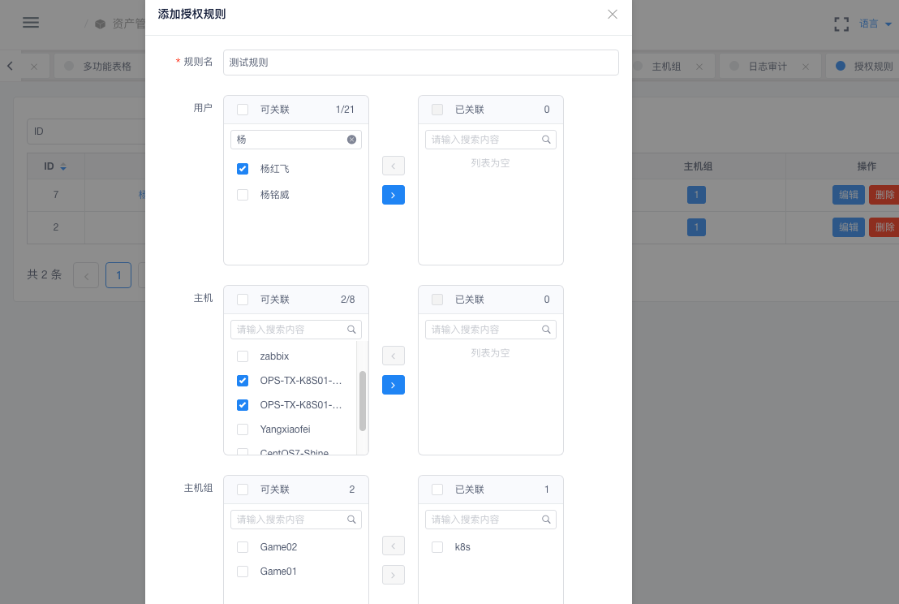

### 资产管理

> 这部分主要介绍CMDB资产管理，后续我们会进行调研开发更加详细功能。

#### 特色功能

- 支持单台/批量添加资产
- 支持批量推送/批量更新/批量删除
- 支持Web Terminal登陆，方便直接网页SSH登陆操作
- 支持用户权限授权，针对不同用户赋权不同资产/资产组
- 支持用户操作日志审计、录像回放功能，让操作有审计记录
- 支持标签管理、多个标签可以方便你快速的区分你的资产分类
- 支持管理用户、多管理用户选择可以解决你多云、多服务器、不同密钥主机连接问题

CMDB主要功能：`主机/主机组/标签管理`、`Web Terminal登陆`、`日志审计录像回放`等功能

#### 主机管理
> 主机管理就是你的资产列表，这里你可以对你的资产进行操作，如：编辑信息、SSH登陆等

**添加主机**

> 这里只需要填写几个必填项即可，其余的后续都会自动获取到
- 主机名：服务器Hostname
- 主机组：选择关联你的主机组
- IDC： 机房位置
- 管理用户： 是用来登陆你机器的用户，Linux系统用户密码/密钥
- IP： 服务器的IP地址
- port: 服务器SSH端口
- Tag标签： 可关联标签
- Other: 其余的可以选择不填，自动获取

**公钥推送**
> 选择主机，点击->公钥推送， 先推送公钥，后续用来获取资产信息使用

- 推送成功后连通性显示：true
- 推送失败后连通性显示：false

**资产更新**

> 选择已经推送过公钥的主机，资产更新会自动抓取服务器资产信息

#### 网页登陆

- 点击主机后面`ssh` Web Terminal 登陆

#### 日志审计
- 命令统计
- 录像回放
- 登陆日志

**登陆日志**

**命令统计**

**录像回放**

#### 授权规则

- 根据授权规则可以对CoDo平台用户授权主机/主机组

**用户授权**

#### 管理用户
> 管理用户是用来登陆资产主机的用户，一般主机用户是root，添加资产的时候选择此用户用来登陆你的主机，自动更新资产等

**添加用户**
- 名称: 建议有意义的名称
- 用户名：Linux系统用户
- 密码： Linux系统用户密码（如果是密钥可不填）
- 私钥：Linux系统用户的Key（和密码二选一）
- 描述：备注信息

