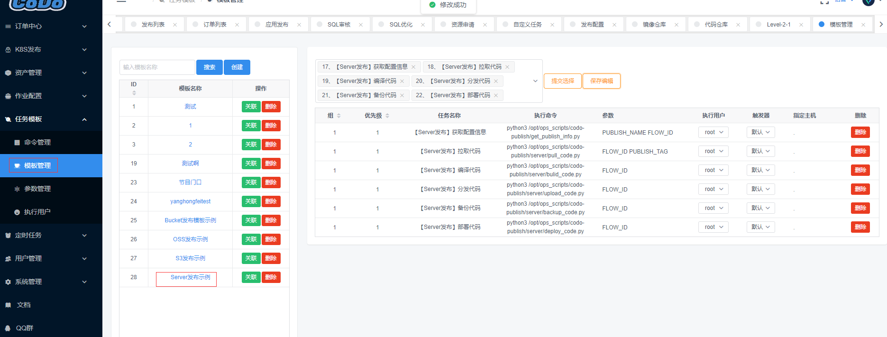

### 作业配置

> 这部分主要介绍作业配置(更新中)，作业配置后续将会支持众多作业配置，目前只支持发布相关的配置；


#### 发布配置

> 预先配置你发布的应用信息，如：环境、主机、Git库等，


例举例一个简单发布示例：

- ①创建命令
- ②配置模板
- ③配置仓库
- ④新建应用
- ⑤提交发布

**创建命令**

> 我们提供了基于`服务器`和`Bucket`基础发布脚本示例供你使用.

克隆代码
```shell
##将代码放到/opt/ops_scripts目录下，后续平台要使用到
mkdir -p /opt/ops_scripts
cd /opt/ops_scripts && git clone https://github.com/opendevops-cn/codo-publish.git
cd codo-publish && pip3 install -r requirements.txt

##修改对应settings里面API网关地址，用户密码信息
vim settings.py
api_gw = 'gw.opendevops.cn'
```


接着到平台添加命令，点开`任务模块`-`命令管理`


**配置模板**
点开`任务模块`-`模板管理`


> 这里需要你创建一个模板，如：Server发布示例，添加你的命令，自由排版，模板管理文档参考：[任务模板](http://docs.opendevops.cn/zh/latest/task_template.html#)

- 组：1的为第一组
- 优先级： 按数字顺序执行
- 参数：PUBLISH_NAME和FLOW_ID都是系统变量，不要修改
- 执行用户： 默认127.0.0.1可不选，保持默认即可
- 触发器：这里支持定时支持、人工干预、直接执行，默认是直接执行




**配置代码仓库**

点开`作业配置`-`代码仓库`

> 这里需要你配置一个git仓库地址，要发布的代码仓库。


**新建应用**
点开`作业配置`-`发布配置`
- 发布应用：建议一个有意义的名称
- 发布类型：选择发布类型，支持(服务器、存储桶)
- 构建主机：哪台主机执行操作，默认（127.0.0.1）
- 代码仓库：下拉选择你的代码库
- 关联模板：下拉选择你要关联的模板
- 排除文件：exclude排除，如图，多个按行隔开
- 发布类型：目前只支持简单发布
- 目标主机：ip port user password格式，多个按行隔开
- 目标主机组：CMDB里面API主机组的信息，可通过CMDB组里面点击获取API地址
- 发布目录: 服务器的代码目录如：/var/wwww/yanghongfei/


**提交发布**
> 最后提交发布，发布是基于git tag的，需要你在要发布的版本库上打上tag


提交发布后会在订单列表里面显示出来你将要执行的任务，
当你点击到这个任务的时候，我们会把任务信息给展示出来方便你来确认，最后需要你进行审批，可选择时间执行。


如下图示例有一个手工干预的，需要你点击终止全部旁边的干预名称进行执行。


点击完审批后会进入等待执行，随后会按照你模板里面的顺序进行执行


最后执行完成后会显示状态OK，
- 若执行途中有报错，会暂停任务，可根据`日志`进行排错，进行`重做`
- 若执行途中有报错，且你不希望本组服务器进行执行了，可以点击`终止`
- 若整个任务都不想要了，可以点击`终止全部`


> PS: 作业配置和任务模板编排作业任务，稍有点复杂，我们正在不断优化系统和文档，感谢你的支持。


