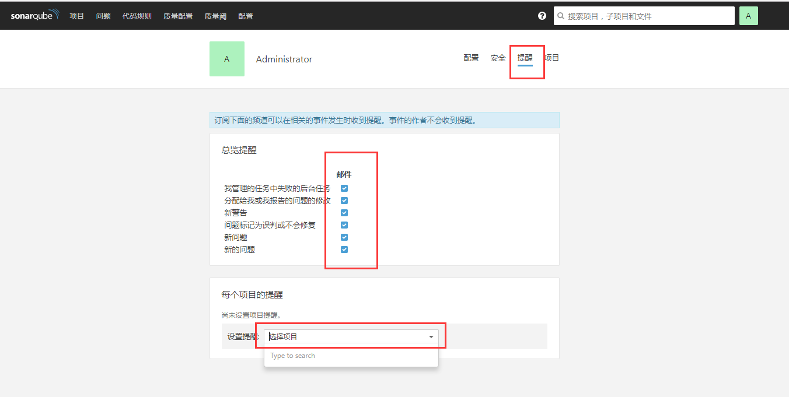

### sonarQube部署文档

> opendevops平台所用插件SonarQube部署文档， 部分文档会因为版本迭代不可用，此文档只作为参考文档，谢谢。

[官网](https://www.sonarqube.org/)


**简介**

> SonarQube 是一个开源的代码分析平台, 用来持续分析和评测项目源代码的质量。 通过SonarQube我们可以检测出项目中重复代码， 潜在bug， 代码风格问题，缺乏单元测试等问题， 并通过一个web ui展示出来。

**基础的架构**
- Database
- SonarQube Server
- SonarQube Scanner
- Project
- Nginx （如果不需要通过nginx转发则不需要Nginx模块）

**SonarQube服务端** 


直接拉取仓库中的docker镜像启动服务, docker、docker-compose安装参考[初始化脚本](https://github.com/opendevops-cn/opendevops/tree/master/scripts)

```
mkdir -p /data/sonarqube/

cat >/data/sonarqube/docker-compose.yml <<EOF
version: "2"

services:
  sonarqube:
    image: ss1917/sonarqube:latest
    ports:
      - "9000:9000"
    networks:
      - sonarnet
    environment:
      - SONARQUBE_JDBC_URL=jdbc:postgresql://db:5432/sonar
    volumes:
      - /data/sonarqube/conf:/opt/sonarqube/conf
      - /data/sonarqube/data:/opt/sonarqube/data
      - /data/sonarqube/extensions:/opt/sonarqube/extensions
      - /data/sonarqube/bundled-plugins:/opt/sonarqube/lib/bundled-plugins

  db:
    image: postgres
    networks:
      - sonarnet
    environment:
      - POSTGRES_USER=sonar
      - POSTGRES_PASSWORD=sonar
    volumes:
      - postgresql:/var/lib/postgresql
      - postgresql_data:/var/lib/postgresql/data

networks:
  sonarnet:
    driver: bridge

volumes:
  postgresql:
  postgresql_data:
EOF

cd /data/sonarqube
docker-compose up -d

```

启动docker后访问ip:9000，代表服务已启动,默认登录密码admin/admin


SonarQube配置安装插件，汉化。


如图进入marketplace，搜索汉化包,各类语言代码扫描依赖包， 安装完毕后自动重启。


接下来开始配置sonarqube服务全局配置。


**主要配置项：**

- Server base URL (定义sonar服务访问地址，可用域名或ip)
- Email prefix (发送邮件时的主题前缀)
- From address
- From name
- Secure connection

**smtp安全协议**
- SMTP host
- SMTP password
- SMTP port

配置完成后测试发送


**配置邮件提醒**

在 我的账号-提醒 下设置邮件提醒，也可针对特定项目设置提醒，发送邮件。




至此sonarqube服务端安装配置全部已完成。


**SonarQube客户端(必装)**
> 配置好sonar的服务端之后，接下来就要使用sonar检测我们的代码了，sonar主要是借助客户端检测工具来检测代码，所以要使用sonar必须要在我们本地配置好客户端检测工具
客户端可以通过IDE插件、Sonar-Scanner插件、Ant插件和Maven插件方式进行扫描分析，此处使用的是Sonar-Scanner,sonar的命令行分析端软件还有Sonar-Runner,和Scanner使用差不多


**此处我们使用sonar-scanner**

`注意：这里客户端后续代码检查脚本会调用此客户端执行代码检查`

```shell
wget https://sonarsource.bintray.com/Distribution/sonar-scanner-cli/sonar-scanner-cli-3.2.0.1227-linux.zip
unzip  sonar-scanner-cli-3.2.0.1227-linux.zip
mv sonar-scanner-3.2.0.1227-linux/ /usr/local/sonar-scanner
export SONAR_RUNNER_HOME=/usr/local/sonar-scanner
export PATH=$SONAR_RUNNER_HOME/bin:$PATH
```
