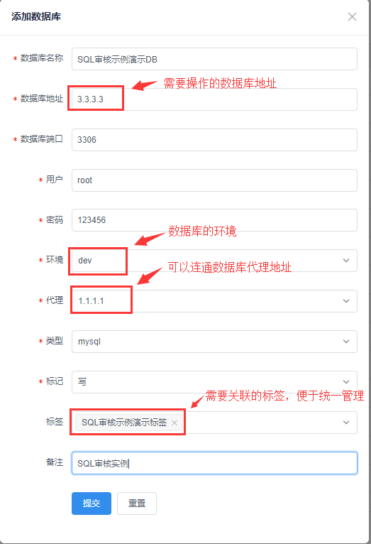

### 基于任务平台实现SQL审核示例

> 列举一个平台上任务发布里面SQL审核部分的实例，让大家快速灵活的使用OpenDevOps平台，进行实战操作；

**创建一个需要操作的数据库标签**

**新建标签**

点开`作业配置`-`标签树`-`root`-`新建标签`

- 具体字段参数含义详见`使用文档`--`作业配置`--`标签树`

**注意**
>授权用户：只有授权过的用户，在创建任务发布时才有权限对该标签操作

**代理配置**

>预先配置好代理服务器地址，用于创建标签树下DB时可供选取，该代理是用来连接无外网状态下的数据库而存在的。

- 具体字段参数含义详见`使用文档`--`作业配置`--`代理配置`

**新建DB**

> 点开`作业配置`-`标签树`-`DB`-`添加数据库`

- 具体字段参数含义详见`使用文档`--`作业配置`--`标签树`

**创建一个SQL审核任务发布**

点开`任务发布`--`SQL审核`

**进行审核提交**

>点开`订单中心`--`订单列表`

**注意**

>由于inception对于删除数据库语句的操作是进行过滤的，所以不能在SQL审核里面有删库语句出现；对于SQL语句不规范的也会有相应的报错提示，建议在执行SQL审核之前，先进行SQL优化操作；对于一些忽略的报错，可以进行手动干预。

