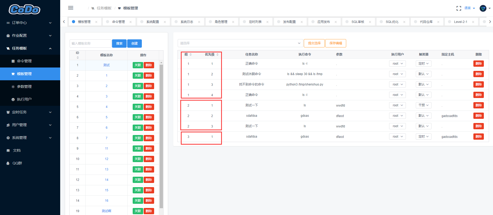
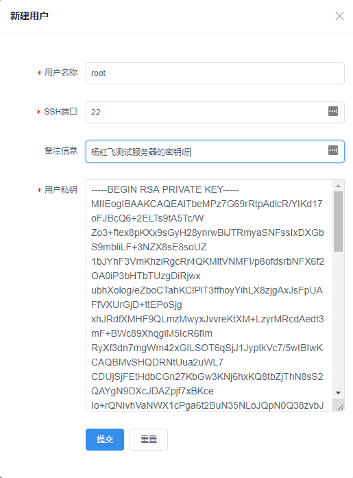

### 任务模板

> 这部分文档主要用来介绍任务模板，任务模板：可以帮助你实现一个很强大、很复杂、可干预、自定义的任务流程模板；
> 任务模板功能主要分为：命令管理、模板管理、参数管理、执行用户等部分，由于这块稍微有点难理解，我们提供了[示例文档](http://docs.opendevops.cn/zh/latest/task_example.html)和[视频演示](https://www.bilibili.com/video/av53424572/)


#### 命令管理
> 主要用于创建你的自定义命令，后续供平台执行使用

**功能特点**
- 支持`Linux Bash`命令
- 支持自定义脚本命令(不限语言)
- 全局命令统一管理、详细记录展示
- 命令可视化编辑、搜素、新增、删除等操作

**如何使用**

点开`任务模板`->`命令管理`
- 新建命令
  - 命令名称：输入你的名称(建议是有意义的名字，后续方便你勾选使用)
  - 执行命令：可以是`Linux Bash`命令，如：`ls,free -m`，也可以是一个执行脚本，如：`python3 xxx.py`
  - 命令参数：这里一般用于执行脚本传入参数，如：`pytho3 xxx.py --host=127.0.0.1`，这里就可以填入自身参数：`--host=127.0.0.1`, 可留空，也可后续使用到修改
  - 强制主机：默认可为空，用于你所填写的命令强制指定哪个主机上进行执行（注意：你所指定的这台机器IP，此平台必须可以登陆过去，否则无法执行，CODO平台如何登陆所指定的主机IP请参考`执行用户`文档）


示例图：


#### 模板管理
> 模板管理是一个核心功能，这里逻辑稍有复杂、但功能极为强大，这里主要用于自定义你的任务流程。

**功能特点**
- 支持自定义模板流程
- 支持多组多优先级并发执行
- 自定义流程可人工干预、可定时执行
- 模板可搜素、可编辑、可删除、模板权限细分等


**如何使用**  

点开`任务模板`->`模板管理`
- 创建模板
  - 模板名称： 建议输入一个有意义的名称，注意：`此名称不可更改`


**如何对模板赋权**
> 模板赋权是☞哪些用户可以对此模板有权限（编辑、删除、修改等），管理员默认拥有所有权限。

点开`任务模板`->`模板管理`->`关联`-`选择关联的用户`


**自定义你的模板流程**

首先我们已经创建了一个新的模板，接下来我们向模板里面添加一些自定义的内容
- ①选中你的模板
- ②下拉选择你的命令进行提交（支持同时选择多个哦~）
- ③修改模板流程中的字段信息
- ④最后记得保存编辑

示例：


下图字段说明：
- 组：默认为：88， 请修改为：1， 默认从第一组开始执行（多组配置示例见下图）
- 优先级： 执行命令的优先级，修改对应数字即可
- 任务名称： 此任务名称是你`命令管理`命令名称，自动带出
- 执行命令： 此执行命令是你`命令管理`执行命令，自动带出
- 参数：此参数是你`命令管理`参数，自动带出，`参数例如：--host=127.0.0.1 --group=game01`空格隔离第二个参数
- 执行用户： 此执行用户用于登陆你的执行主机，从`任务模板->执行用户`里面选择，详细见`执行用户`部分使用说明
- 触发器：可选默认（默认直接执行）、定时（到达时间后开始执行，此时间是提交任务的时候指定的时间）、干预（需要手动触发执行）
- 指定主机：指定那台主机执行此命令，IP地址形式，`CODO平台需要能登陆此主机`
- 删除： 删除所选项


单组配置示例：


多组配置示例：




#### 参数管理
> 参数名称类似于别名的概念，订单显示时参数值会被参数名称替代

多组配置示例：

​                        

#### 执行用户

> 执行用户：主要用于登陆命令管理/模板管理里面指定的主机的验证，任务一般都是通过SSH进行远程执行、编排模板的时候需要选择一个用户进行登陆主机

**如何使用**
点开`任务模板`->`执行用户`

- 新建用户
  - 用户名称：如：`root, ops`此系统用户，注意：`此用户是Linux系统用户哦~`
  - SSH端口：你的SSH端口，如：`22`
  - 备注：描述用途使用
  - 用户私钥：服务器机器的私钥，一般默认生成的为：`id_rsa`

若你的机器没有私钥，你可以手动生成一堆公钥私钥进行放置到服务器~/.ssh/目录下，参考命令：
```shell
#生成密钥对
$ ssh-keygen -t rsa
# 将公钥加到`authorized_keys`文件
$ [ ! -d /root/.ssh ] && mkdir /root/.ssh ; [ ! -f /root/.ssh/authorized_keys ] && touch /root/.ssh/authorized_keys ; cat /root/.ssh/id_rsa.pub >> ~/.ssh/authorized_keys && chmod 600 ~/.ssh/authorized_keys && echo ok
```

新建执行用户示例：




