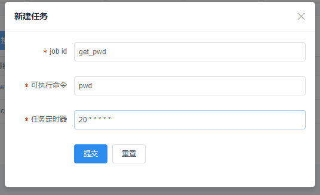

### 定时任务

> 通过定时任务可以进行添加你的定时任务

#### 定时任务特点

- 可视化界面操作
- 定时任务统一管理

- 完全兼容Crontab
- 支持秒级定时任务
- 任务可搜索、暂停、编辑、删除

#### 用户使用说明

- 新增任务
  - Job_id： 任务名称，建议为有意义的英文名称
  - 可执行命令： `Linux Bash` 命令
  - 任务定时器： （秒、分、时、日、月、周）
    - 示例：每分钟的第20秒开始执行`pwd`命令

- 编辑任务

- 暂停恢复
  - 状态栏可以将任务暂停/恢复

- 任务日志
  - 每条任务执行都会记录日志
  - 日志可根据Job_id、状态、关键字、时间范围等搜索

