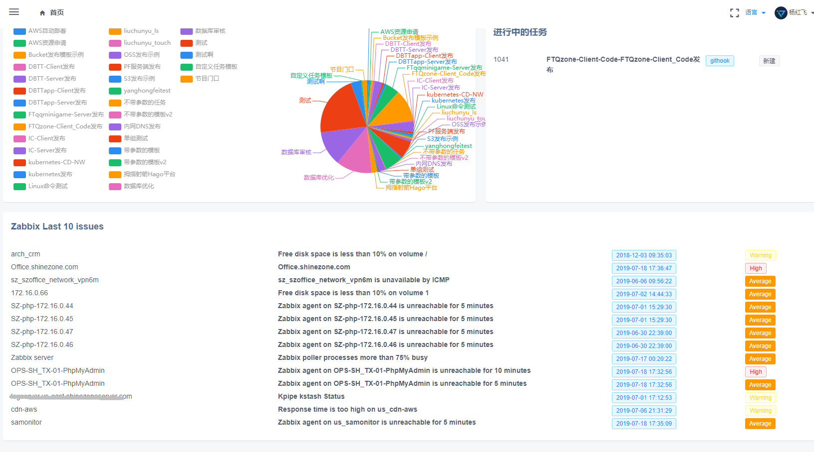
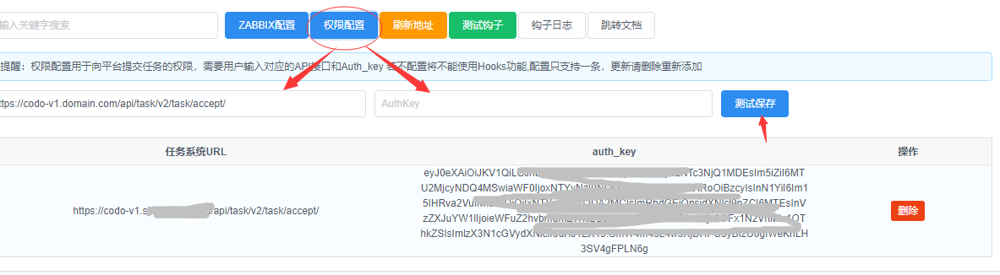
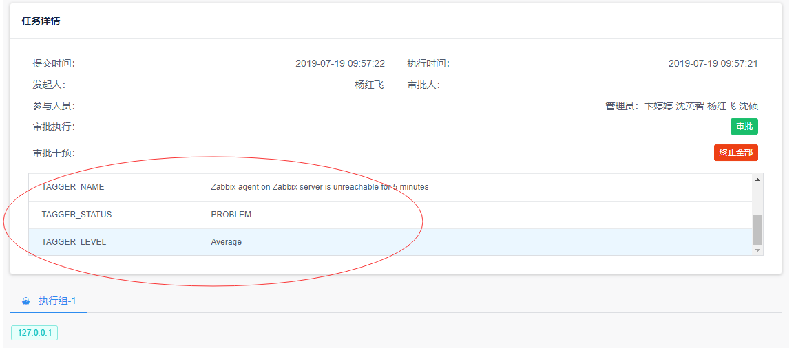
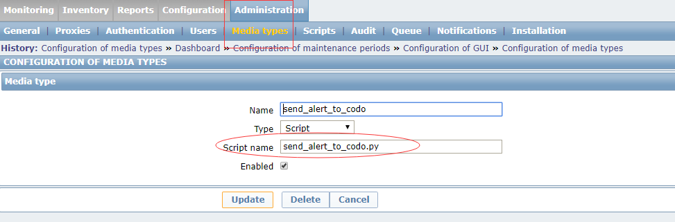
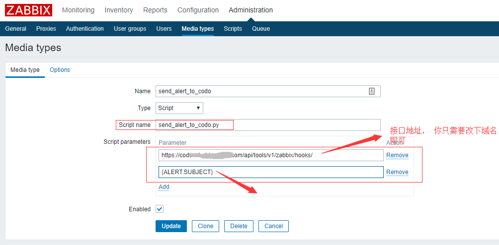
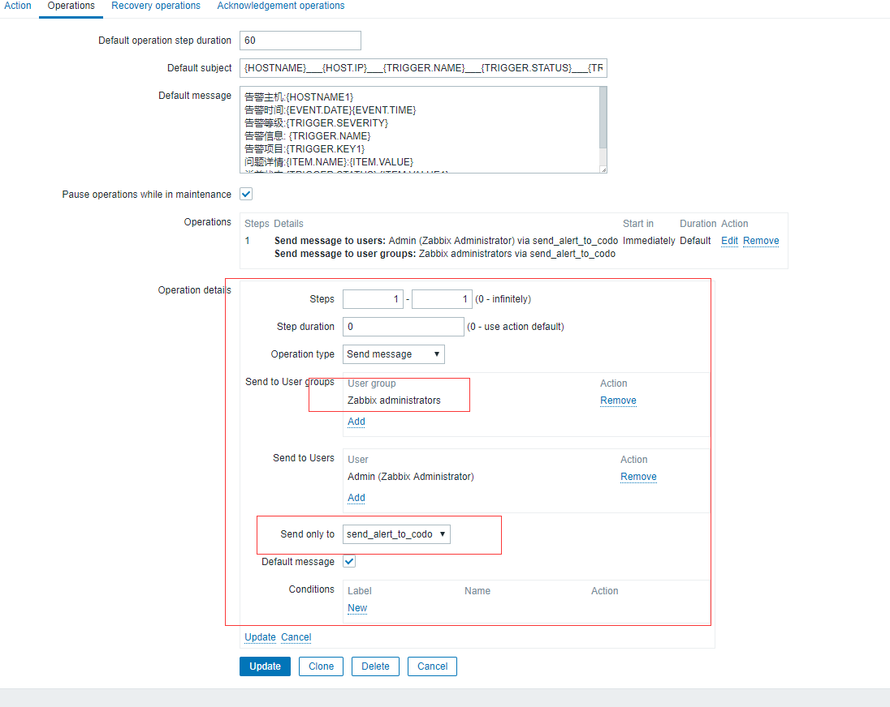

### 监控告警


> 监控报警主要分为2部分，ZABBIX+Prometheus 都是基于Webhook做的


**ZABBIX**

本章主要介绍下CODO中的ZABBIX怎么使用，他能帮你做什么？


**功能简介**

- 支持多ZABBIX配置
- 支持多ZABBIX webhooks同时接入
- 支持多ZABBIX webhook告警日志展示
- 支持多ZABBIX 配置钩子实现故障自愈、自定义任务等
- 获取多ZABBIX Last Issues统一展示，不再多个系统之间奔波


**首先，点击ZABBIX配置，配置你的地址**


**刷新地址，将已配置的ZABBIX组/主机Hostname拉取下来**


**回到首页，你可以看到你多个ZABBIX Last Issues都统一展示出来了**



至此，到这一步，已经将ZABBIX的信息给获取下来了, 并且可以看到  Last ISSUES了

But，你如果觉得这些还不够，接下来想要对报警进行下一步的操作，比如我要`故障自愈`，那么你就要开始用钩子功能了

这部分的逻辑是`配置权限`--->`配置ZABBIX webhook`--->`配置钩子`---->`根据告警tagger_name匹配`--->`故障自愈/自定义任务等操作`


那么，让我们开始吧。


**配置权限**

- 权限配置用于向平台提交任务的权限，需要用户输入对应的API接口和Auth_key
- auth_key：是管理员生成的长期Token
- task_url：https://codo-v1.domain.com/api/task/v2/task/accept/  

测试保存，这里会进行权限认证，只有通过了认证才能保存成功。




**配置钩子**

选择一台机器，进行配置钩子


新建一个钩子， 这里可以配置多个 那么这里是怎么匹配的呢？ 简单记录下。

- 收到告警后，开始根据告警的ZABBIX地址+ZABBIX 主机查询 这个主机有配置钩子
- 如果有钩子规则，开始全匹配告警的tagger_name和你配置的tagger_name是不是一致的，一致的之间触发任务


**测试钩子**

- 模拟ZABBIX告警信息来测试告警是否匹配，从而触发钩子任务

  





从上图可以看到，正常匹配到了，触发了任务， 数据也传了过来，接下来了有数据，用户可以实现自己的逻辑了。


那么如果告警没匹配怎么办， 我们来测试下  


可以看到，他会给我说匹配不到钩子  


**钩子日志**


我们通过刚来的测试看下钩子日志

- 匹配到的会记录下来，并打出来执行的模板等信息
- 接收到的告警，没匹配也会记录下来，但是不做任何操作


**ZABBIX webhook**

到了这一步，我们都是平台配置和测试，那么如果想要接入ZABBIX告警信息，就必须要借助的ZABBIX 的webhook功能

这里我们接着操作，接入ZABBIX，实现全局监控ZABBIX告警，自动触发，故障自愈，自定义任务等操作


ZABBIX的版本迭代也是蛮快的，为了更好的让用户使用，不同的版本我写了不同的适配脚本来实现， 差别不大


谈一下ZABBIX配置， 这里只要是配置一个ZABBIX mediatype，和 Action触发器，将告警信息发到我的接口里面，我来帮你分析


**先来讲一下ZABBIX2.0**

ZABBIX 2.0 的版本是不支持mediaType里面传参的，但是他有三个默认参数，$3是邮件内容 $2 邮件标题 $1 发送给谁

既然他不支持自定义参数，那我们就借助他的默认参数，这里我用到了$2 第二个标题参数


**先将脚本放到服务器上**

脚本放在那？  这个要看你配置在那里了，不管是Mail\SMS\Webhooks  只要是触发脚本类型的都在这里


```shell
#让我们查一下你的配置是什么？

$ grep -r "AlertScriptsPath" /etc/zabbix/zabbix_server.conf

AlertScriptsPath=/usr/lib/zabbix/alertscripts   #脚本就放在这里

```

ZABBIX2.0版本

官方示例脚本：

```python
#!/usr/bin/env python
# -*- coding: utf-8 -*-
# @Time    : 2019/7/10 10:09
# @Author  : Fred Yangxiaofei
# @File    : send_alert.py
# @Role    : Zabbix webhooks 发送告警信息测试


# zabbix3.0+配置

import sys
import requests
import json


def send_alert(zabbix_url, webhook_url, messages):
    # 这里就是一个长期Token，管理员可以在用户列表选择一个用户进行生成一个长期Token， 但是需要对/tools/v1/zabbix/hooks/接口有权限
    params = {
        "auth_key": "eyJ0eXAiOiJKV1QiLCJhbGciSmW4m45L4w5XjDHPU3yBIzU0gfWeKnLH3SV4gFPLN6g"
    }
    # payload = "{\"data\": \"test\"}"
    payload = {"zabbix_url": zabbix_url, "messages": messages}
    headers = {'content-type': "application/json", 'cache-control': "no-cache"}
    response = requests.post(url=webhook_url, data=json.dumps(payload), headers=headers, params=params)
    print(response.text)


if __name__ == '__main__':
    # 你的ZABBIX地址,高版本ZABBIX你也可以从ZABBIX配置中传过来,请确保你和CODO平台上配置的一模一样
    zabbix_url = 'http://zabbixdoamin.com/zabbix'

    webhook_url = 'https://codo.domain.com/api/tools/v1/zabbix/hooks/'


    # ZABBIX的告警信息，这个我要用到，所以就要强规范：{HOSTNAME}___{HOST.IP}___{TRIGGER.NAME}___{TRIGGER.STATUS}___{TRIGGER.SEVERITY}
    messages = sys.argv[2]

    send_alert(zabbix_url, webhook_url, messages)

"""
如何使用：

pip install json
pip install requests

如何测试：

python send_alert_to_codo.py '' 'Zabbix server___127.0.0.1___Zabbix agent on Zabbix server is unreachable for 5 minutes___PROBLEM___Average'
"""


```


**配置好了脚本，我们来配置2版本的ZABBIX**





**配置一个Action**

这里为了不影响你现有的，我们之间配置一个新的

但是这里切记标题是强规范，将我的标题给复制进去，其余的不重要

```

{HOSTNAME}___{HOST.IP}___{TRIGGER.NAME}___{TRIGGER.STATUS}___{TRIGGER.SEVERITY}

```


以上，是ZABBIX 2.0版本的配置


**ZABBIX3.0配置webhook**

现在相信很多人也都用了最新的ZABBIX，那么我们必然也要支持以下了，ZABBIX 3.0+就支持自定义传参了，这个还是挺人性化的， ZABBIX3.0和2.0的配置思路一样，接下来让我们开始吧。


**先将脚本放到服务器上**

脚本放在那？  这个要看你配置在那里了，不管是Mail\SMS\Webhooks  只要是触发脚本类型的都在这里


```shell
#让我们查一下你的配置是什么？

$ grep -r "AlertScriptsPath" /etc/zabbix/zabbix_server.conf

AlertScriptsPath=/usr/lib/zabbix/alertscripts   #脚本就放在这里

```

ZABBIX3.0版本

官方示例脚本：

```python

#!/usr/bin/env python
# -*- coding: utf-8 -*-
# @Time    : 2019/7/10 10:09
# @Author  : Fred Yangxiaofei
# @File    : send_alert.py
# @Role    : Zabbix webhooks 发送告警信息


# zabbix3.0+配置

import sys
import requests
import json


def send_alert(zabbix_url, webhook_url, messages):
    # 这里就是一个长期Token，管理员可以在用户列表选择一个用户进行生成一个长期Token， 但是需要对/tools/v1/zabbix/hooks/接口有权限
    params = {
        "auth_key": "eyJ0eXAiOiJKV1QiLCJ.SmW4m45L4w5XjDHPU3yBIzU0gfWeKnLH3SV4gFPLN6g"
    }
    # payload = "{\"data\": \"test\"}"
    payload = {"zabbix_url": zabbix_url, "messages": messages}
    headers = {'content-type': "application/json", 'cache-control': "no-cache"}
    response = requests.post(url=webhook_url, data=json.dumps(payload), headers=headers, params=params)
    print(response.text)


if __name__ == '__main__':
    zabbix_url = 'http://xxxxx/zabbix'  # 你的ZABBIX地址,高版本ZABBIX你也可以从ZABBIX配置中传过来
    webhook_url = sys.argv[1]
    messages = sys.argv[2]

    send_alert(zabbix_url, webhook_url, messages)

"""
如何使用：

pip install json
pip install requests

如何测试：

python send_alert_to_codo.py https://codo.domain.com/api/tools/v1/zabbix/hooks/ alert_message_test
"""

```

ZABBIX3.0配置





**配置一个Action**

这里为了不影响你现有的，我们之间配置一个新的

但是这里切记标题是强规范，将我的标题给复制进去，其余的不重要

```

{HOSTNAME}___{HOST.IP}___{TRIGGER.NAME}___{TRIGGER.STATUS}___{TRIGGER.SEVERITY}

```





接下来就完成了，你可以触发一个告警，进行测试了。

