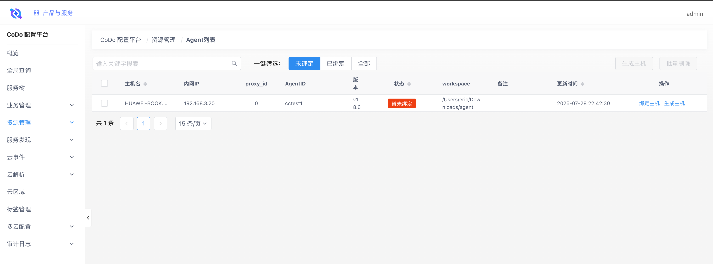
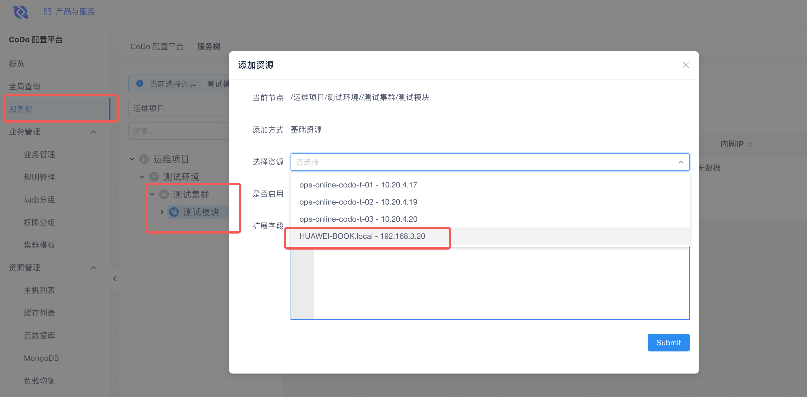
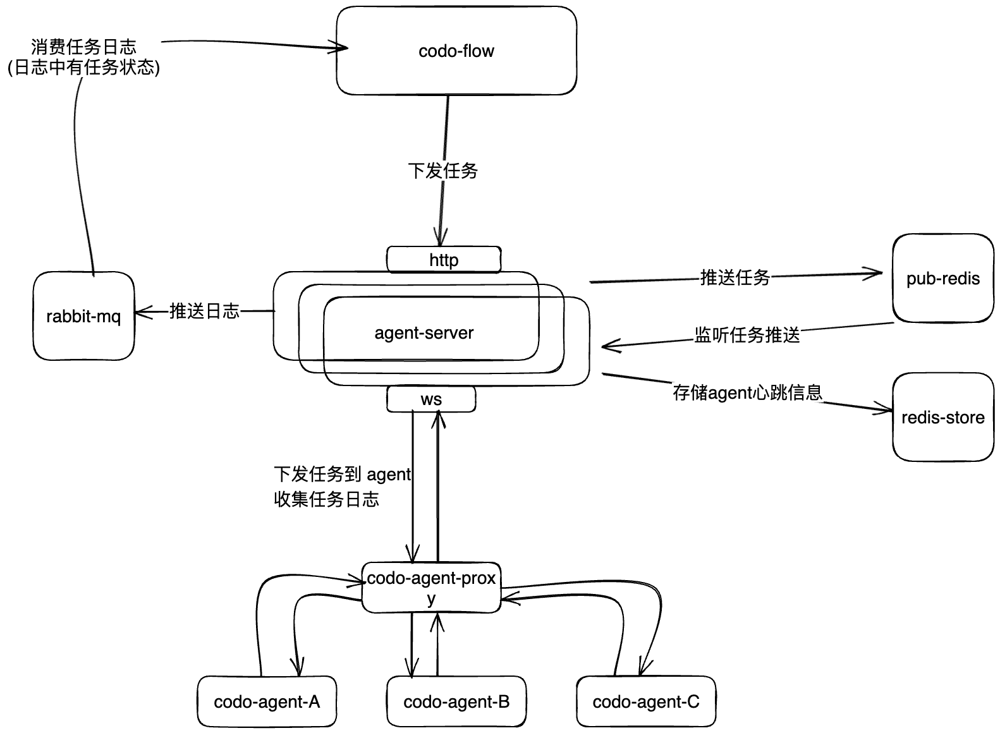
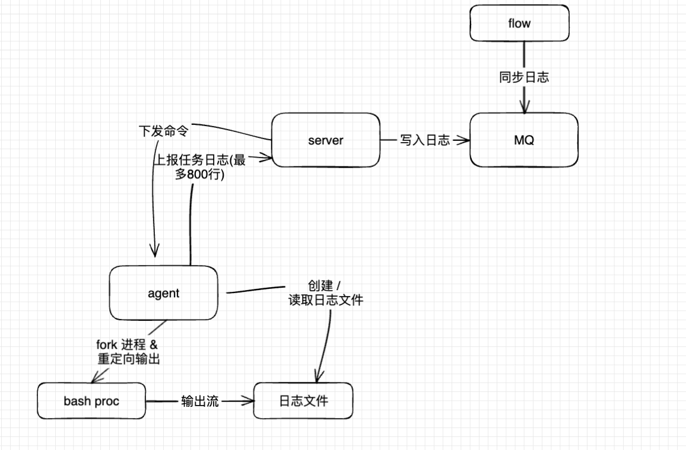

# 手把手教你玩转 一站式运维平台(CODO) - 5.1 安装 codo-agent

# codo-agent入门到精通

## 简单使用

### codo-agent


#### 启动 agnet

```shell
curl -L -o ./codo-agent https://github.com/opendevops-cn/codo-agent-server/releases/download/v1.8.6/codo-agent-linux-amd64
chmod +x ./codo-agent
./codo-agent --config-file ./config.yaml
```

#### 配置详情

以下是简单配置:

```yaml
# 日志等级(必填, 默认 info)
# - DEBUG
# - INFO
# - WARN
# - ERROR
LOG-LEVEL: info
# 业务ID(必填, 默认 502)
BIZ-ID: "504"
# 连接服务地址(必填, agent-server 的地址, clientId 需要全局唯一)
# SERVER-ADDRESS: "ws://127.0.0.1:8002/api/v1/codo/agent?clientId=huaweibook1"
# 也可以是 AGENT-PROXY 的地址
# SERVER-ADDRESS: "ws://127.0.0.1:9999/api/v1/codo/agent?clientId=huaweibook1"
# 也可以填 demo 的地址
SERVER-ADDRESS: "ws://demo.opendevops.cn/api/agent-ws/v1/codo/agent?clientId=cctest"
```

以下是全量配置:

```yaml
# 日志等级(必填, 建议 info)
# - DEBUG
# - INFO
# - WARN
# - ERROR
LOG-LEVEL: info
# RootPath 日志保存路径(选填, 默认是 工作目录)
# 用于：
# - 存储脚本文件
# - 存储密钥文件
# - 存储执行日志文件
# - 存储agent日志文件
ROOT-PATH: "./data/agent"
# 连接服务地址(必填, agent-server/proxy 的地址, clientId 需要全局唯一)
SERVER-ADDRESS: "ws://127.0.0.1:9999/api/v1/codo/agent?clientId=huaweibook1"
# 节点类型(选填)
# - normal(默认值)
# - master(当节点为master时，自动开启AGENT代理模式, 用于将多个 AGENT 的连接归并起来一起转发到 AGENT-SERVER)(生产环境推荐使用)
NODE-TYPE: "normal"
# 业务ID(必填, 默认 502)
BIZ-ID: "525"
# 本地绑定ip（master模式），本地上报ip地址(选填, 默认取第一张非loppback网卡的ip)
BIND-IP: ""
# 本地绑定端口（master模式下有效）(选填, 默认 20800)
BIND-PORT: 20800
# 日志行数限制(选填, 默认 800)
ROW-LIMIT: 2000
# 最大执行命令数(选填, 默认 100)
MAX-EXEC-CMD: 100
# 以脚本路径作为工作目录(选填, 默认 false)
SCRIPT-PATH-AS-WD: false
# 强指脚本的工作目录(选填, 默认 工作目录)
WORK-DIR: "./data/wd"
# 日志清理间隔(单位：天)(选填, 默认 30)
LOG-CLEAN-INTERVAL: 30
# 实验性参数：WINDOWS 强杀子进程进程树(选填, 默认 false)
EXPR-FORCE-KILL-SUB-PROC: false
```

#### 修改 AGENT ID
agent-id 新版本自动生成, 一旦生成, 一般来说禁止修改.
如果有必须要修改的需求, 可以在 codo-agent 的工作目录下修改
```shell 
echo -n "cctest1" > ./codo_status/.agent_id
```


#### AGENT 绑定业务

agent 连接上之后会默认进入到 CMDB 的 Agent 列表页面.

点击 **生成主机** 用来在业务树上 绑定 agent 机器




> 注意:
>
> 只有集群和模块可以绑定资源, 需要右键业务树节点多创建几层子节点





### codo-agent-server

#### 数据库 migrate

```
./codo-agent-server migrate --config-file ./config.yaml
```

#### 启动 agent-server

```
./codo-agent-server --config-file ./config.yaml
```

#### 配置详情

```yaml
# HTTP 服务端口(用于接收codo-flow的请求)
PORT: 9996
# GRPC 通信端口(暂时没用, 用于服务注册)
RPC-PORT: 9997
# websocket 连接专用端口(用于codo-agent建立 ws 连接)
WS-PORT: 9999
# 性能采集端口(用于提供 metrics )
PPROF-PORT: 9995
# 本机服务监听地址(监听地址, 建议 0.0.0.0)
BIND-ADDRESS: 0.0.0.0


# 日志存放地址(存放 agent-server 打印的运行日志)
ROOT-PATH: E:\go\src\agent-server
# 日志等级(默认 DEBUG)
# - DEBUG
# - INFO
# - WARN
# - ERROR
LOG-LEVEL: DEBUG


# RabbitMQ 配置 (用于将 agent 的日志上报到 codo-flow)
MQCONFIG:
  ENABLED: true
  SCHEMA: "amqp"
  HOST: "127.0.0.1"
  PORT: 5672
  USERNAME: "admin"
  PASSWORD: "123456"
  VHOST: "codo"


# MYSQL 配置, 用于存储 agent-server 的数据
DB-CONFIG:
  DB-TYPE: mysql
  DB-USER: root
  DB-PASSWORD: 123456
  DB-HOST: 127.0.0.1
  DB-NAME: codo_agent_server
  DB-TABLE-PREFIX: codo_
  DB-FILE: ""
  DB-PORT: 3306


# REDIS 配置
# 用于:
#  存储 codo-agent 的心跳
REDIS:
  R-HOST: 127.0.0.1
  R-PORT: 6379
  R-PASSWORD: ""
  R-DB: 1
# REDIS 发布订阅配置
# 用于:
#  CDMB 任务同步
#  CODO 任务分发
PUBLISH:
  P-HOST: 127.0.0.1
  P-PORT: 6379
  P-PASSWORD: ""
  P-DB: 1
  P-ENABLED: true
```

#### 接口

##### 下发任务(异步)

```bash
curl -X POST 127.0.0.1:9996/api/v1/agent/task/batch \
  -H 'Content-Type: application/json' \
  -d '[
    {
      "taskId": "task123",
      "taskType": "ExecCmd",
      "agentId": "agent456",
      "args": {
        "cmd": "sh ${script_path}",
        "timeout": 300,
        "scriptInfo": "#!/bin/bash\n echo helloworld",
				"scriptParams": "{\"a\":1}"
      }
    },
    {
      "taskId": "task124",
      "taskType": "RevokeTask",
      "agentId": "agent789",
      "args": {"taskId": "11asd"}
    }
  ]'
  
不同的 task-type 对应的 args 参数不同
====================================================
GetRunningTask: 获取正在执行的任务
{}

RevokeTask: 取消任务
{"taskId": "11asd"}

ExecCmd: 执行任务
{
"cmd": "sh ${script_path}", // 执行的命令(必填), ${script_path} 是一个魔术变量, 当 scriptInfo 有内容时, 会替换成 scriptInfo 存储的路径
"timeout": 300, // 任务超时时间
“scriptInfo”: “#!/bin/bash\n echo helloworld”, // 脚本模式下, 脚本的内容(选填)
"scriptParams": "{\"a\":1}" // 额外注入的环境变量信息(选填)
}

```


##### 下发任务(同步)

```bash
# 获取正在执行的任务

curl -X POST http://127.0.0.1:9996/api/v1/codo/call \
-H 'Content-Type: application/json' \
-d '{"TaskID": "xxx", "AgentID": "huaweibook1:6666", "TaskType": "GetRunningTask"}'


# 下发任务
curl -X POST http://127.0.0.1:9996/api/v1/codo/call \
-H 'Content-Type: application/json' \
-d '{"TaskID": "abc---huaweibook1:6666", "AgentID": "huaweibook1:6666", "TaskType": "ExecCmd", "args":{"cmd":"echo helloworld","scriptParams":"{}"}}'
```


##### 如果  TaskType 是 ExecCmd, 可以获取实时日志

```bash
# 获取任务 abc---huaweibook1:6666 的日志
curl "http://127.0.0.1:9996/api/v1/manager/agent/task/logv2?task_id=abc---huaweibook1:6666"
```


##### 获取在线的 agent 列表

```
curl 127.0.0.1:9996/api/v1/agent/info
```


## 网络拓扑

在不同网络分区建立 PROXY 节点，收敛网络流量，由 PROXY 节点统一向外部中心调度服务进行流量传输。


## 任务调度

> 之所以推送任务到 redis , 是 因为 agent-server 本身多副本, 对应需要执行任务的 agent 的 ws连接 不一定在 接受到任务下发的 agent-server 上



### 在 ExecCmd 时的调度

