# 手把手教你玩转 一站式运维平台(CODO) - 5.2 使用 codo-flow 实现 应用自动化CI/CD

## [持续集成] 配置打包机组

### 新建打包机组

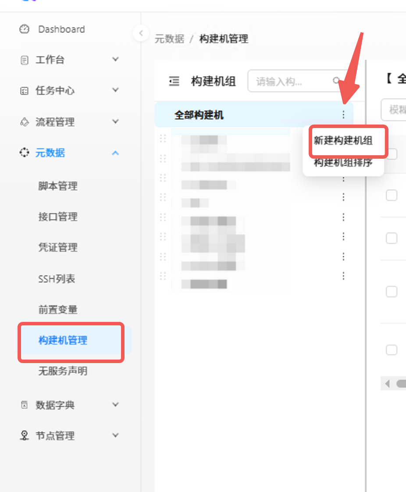

### 添加打包机

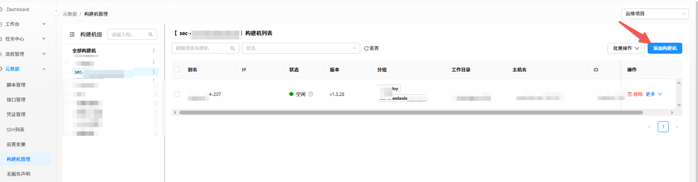

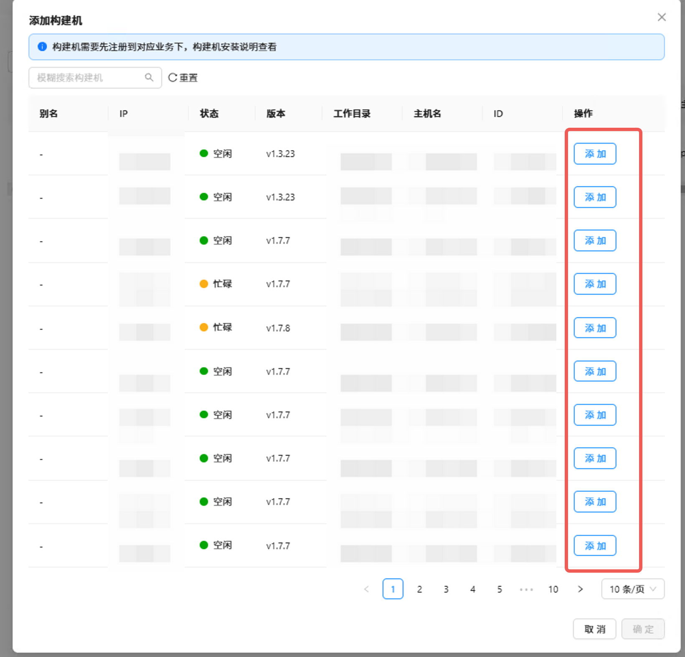

## [持续集成] 配置凭证信息用于拉取代码仓库

- 长文本在脚本中变量指向一个文件路径(文件内容为 实际数据)
- 短文本在脚本中变量直接指向 实际数据

**凭证key 在 脚本中使用 `$CODO_{keyname}` 读取**

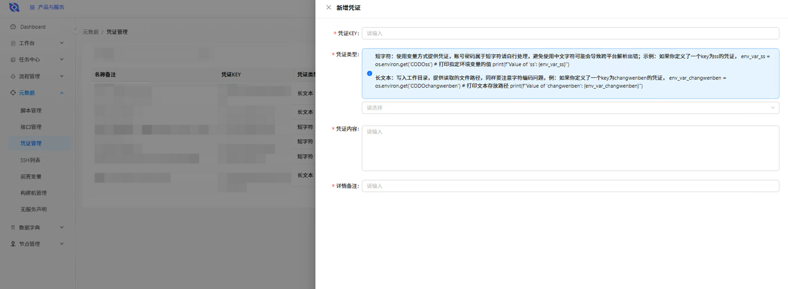

## [持续集成] 编写构建脚本

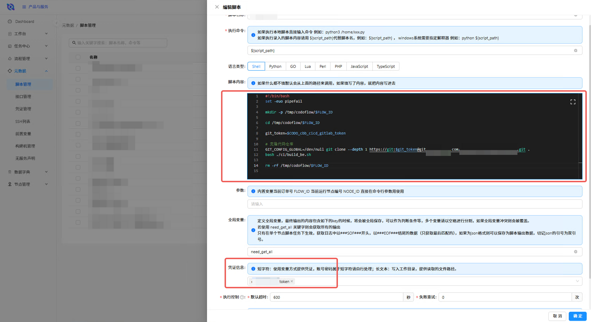

## [持续集成] 配置CI流程

### 选择打包机

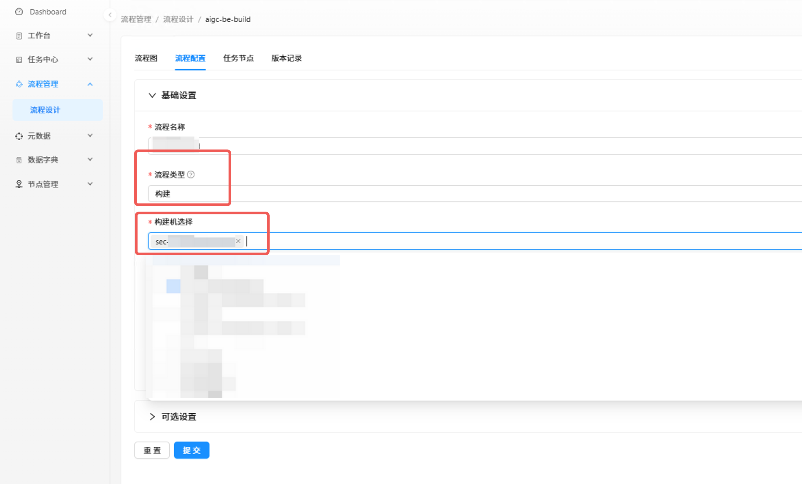

### 选择脚本类型节点, 用于执行脚本任务

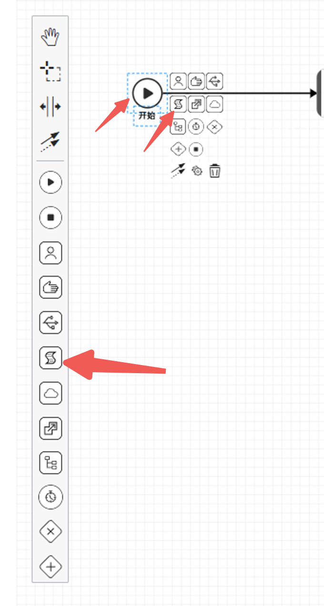

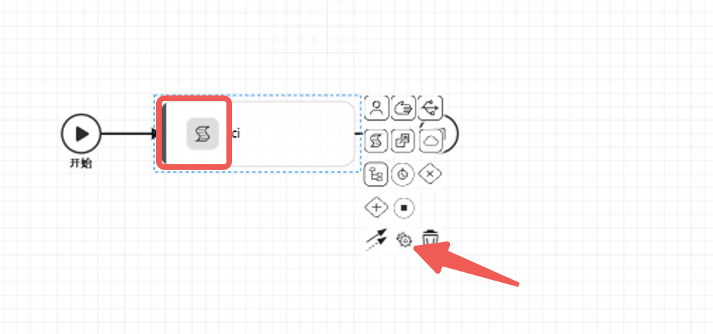

### 选择全局节点

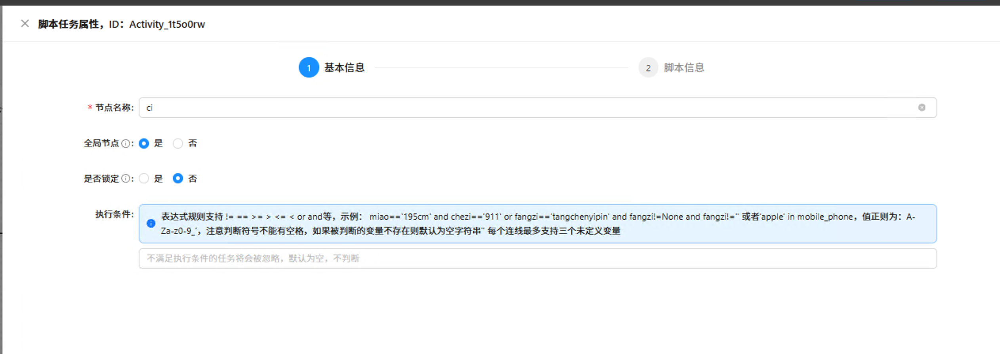

### 选择构建脚本

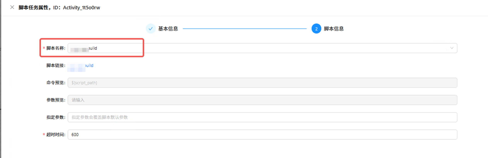

### 配置自定义参数表单

这里的 branch 在 脚本中使用 `codo_branch` 读取

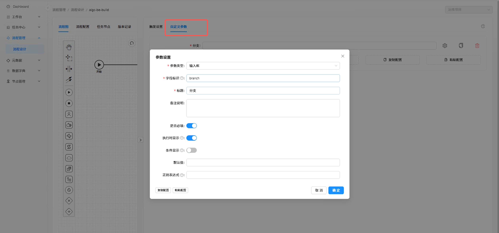

### 配置仓库触发

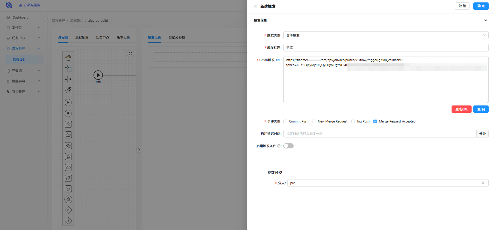

### 点击发布

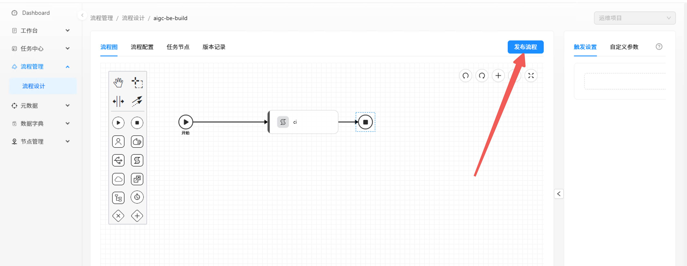

## [持续部署] 配置云原生任务进行部署作业

因为是云原生部署, 并不需要很重的执行环境, 所以我们选择云原生任务来执行部署作业

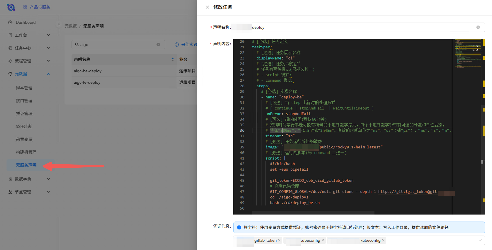

## [持续部署] 配置CD流程

### 添加云原生任务节点

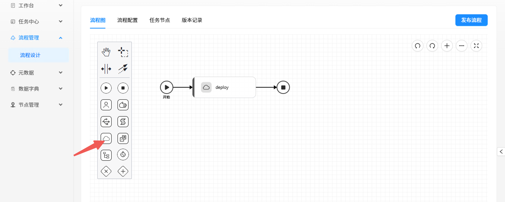

### 选择执行任务的集群 和 任务

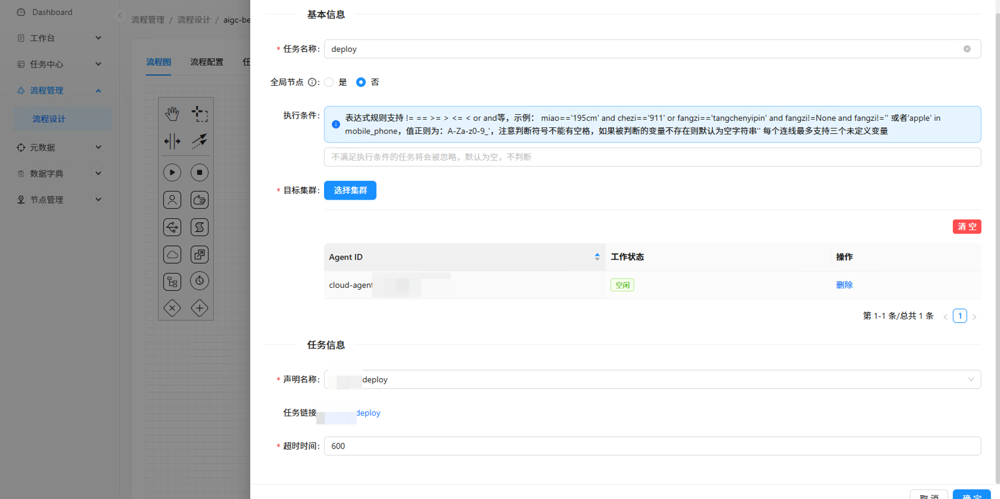

### 配置执行参数

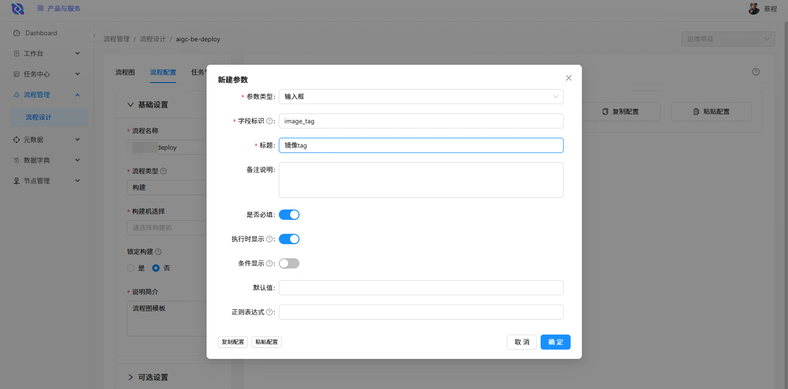

### 发布&触发

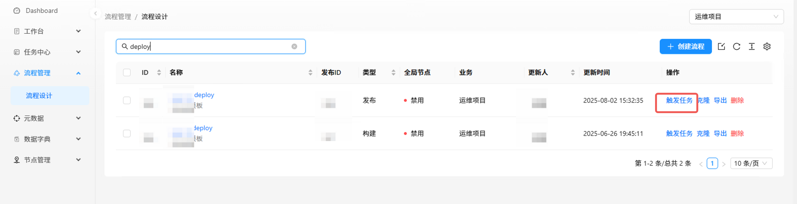

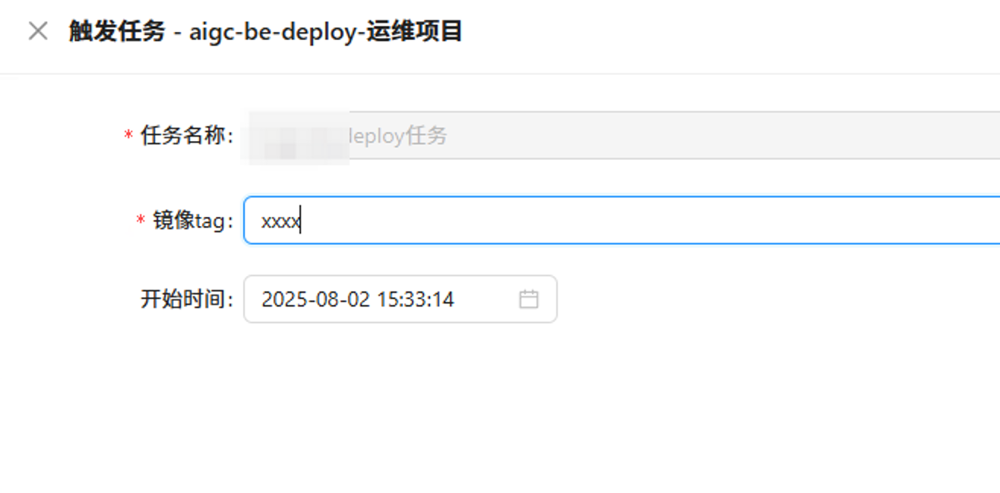
