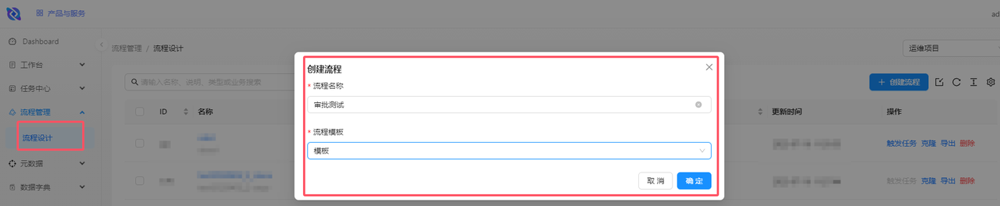
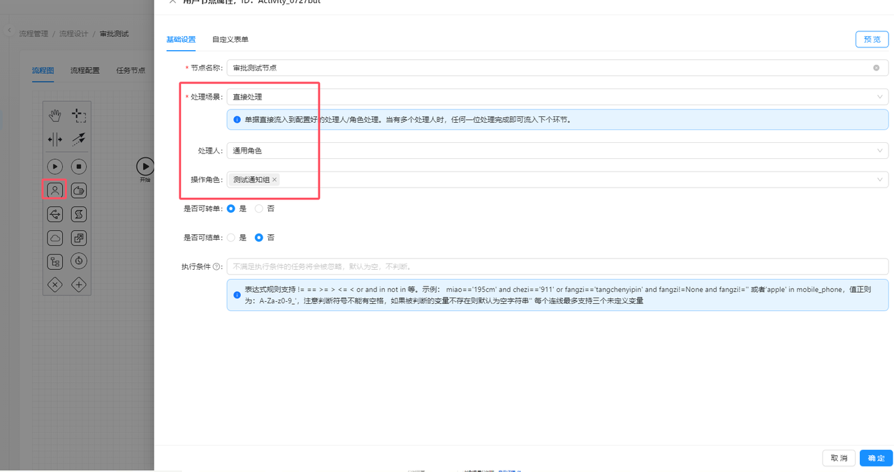
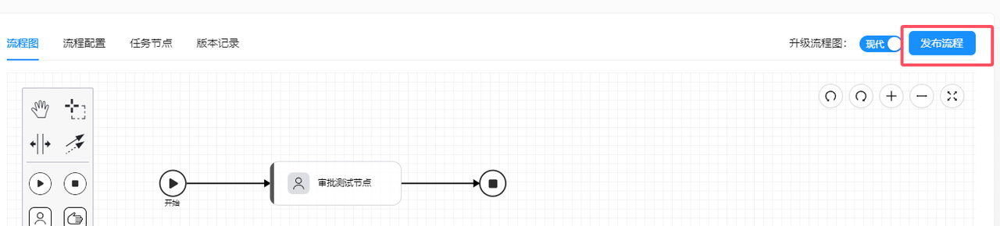
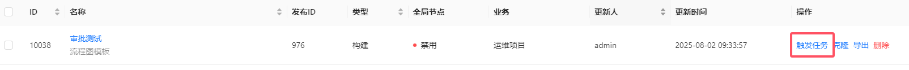
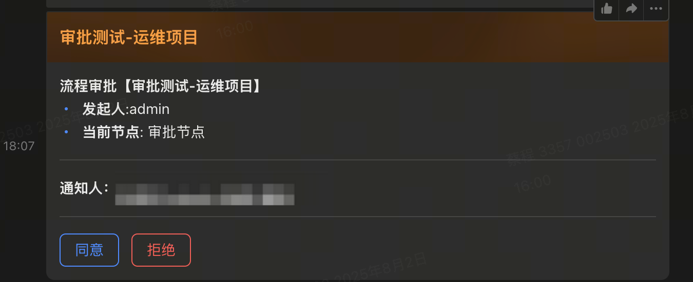

# 手把手教你玩转 一站式运维平台(CODO) - 5.4 codo-flow 配置流程审批

## 通知中心配置

1. ### 配置消息模板

如何获取消息

流程系统会把所有消息回调给消息中心

```Plain
codo_callback_args 系统间回调信息，不用管
codo_flow_creator  订单发起者
title： 订单名称
codo_noticer：通知人
flow_bpm_name：当前审批节点的名称
其他变量都可以直接在通知模板中取用
```


1. ### 配置通知通道


配置回调地址

```Plain
# 同意
https://{补上网关地址}/api/f2-acc/public/v1/flow/approval/agree/
# 拒绝
https://{补上网关地址}/api/f2-acc/public/v1/flow/approval/reject/
```

1. ### 编辑通知路由

> 固定用法 创建 flow_approval=yes   user_task=type1 的路由条件


## 流程配置

1. ### 创建流程



1. ### 使用用户类型的任务



1. ### 发布流程



1. ### 点击触发即可



