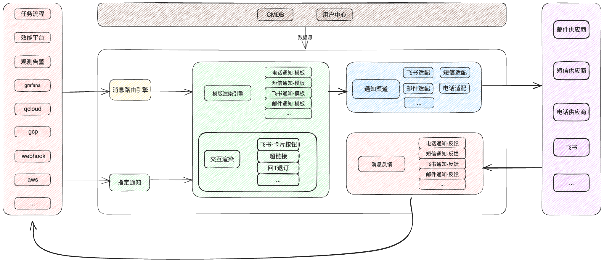
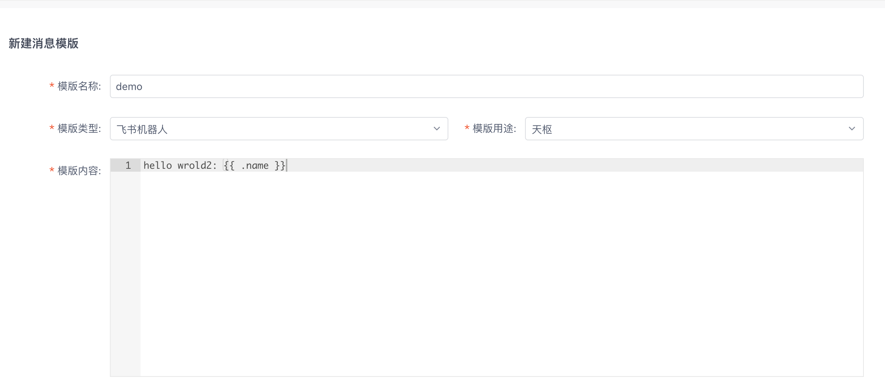
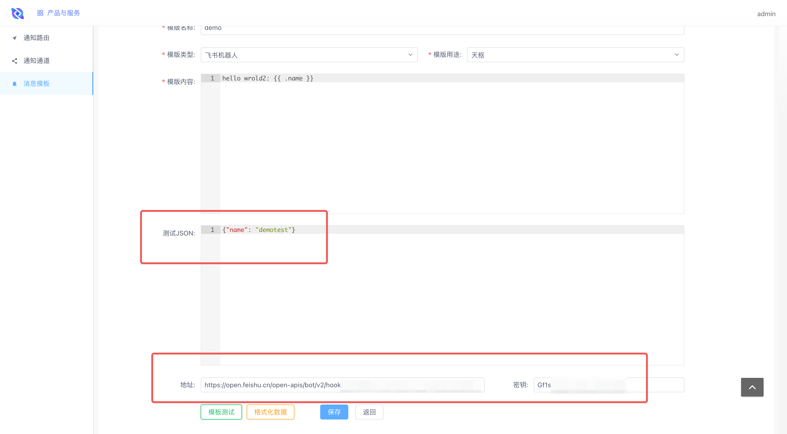
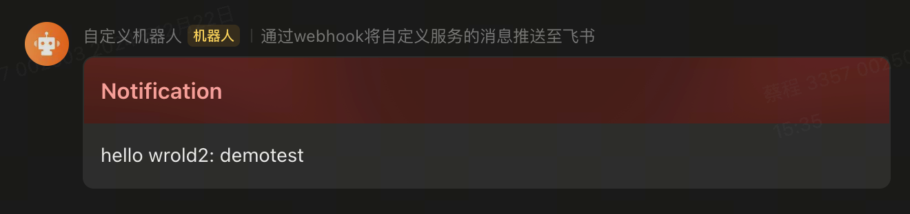
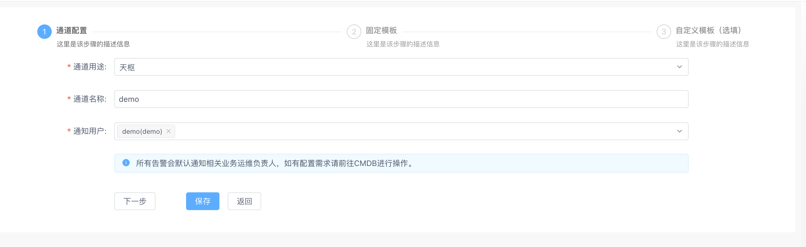
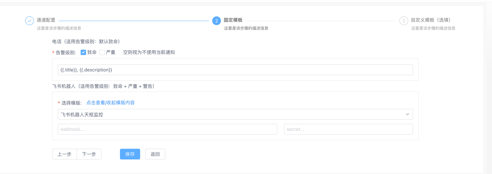
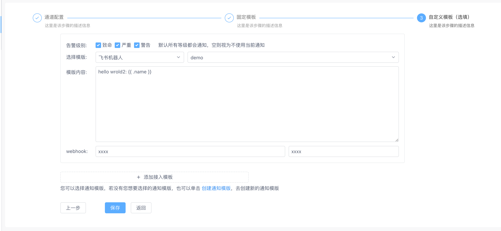
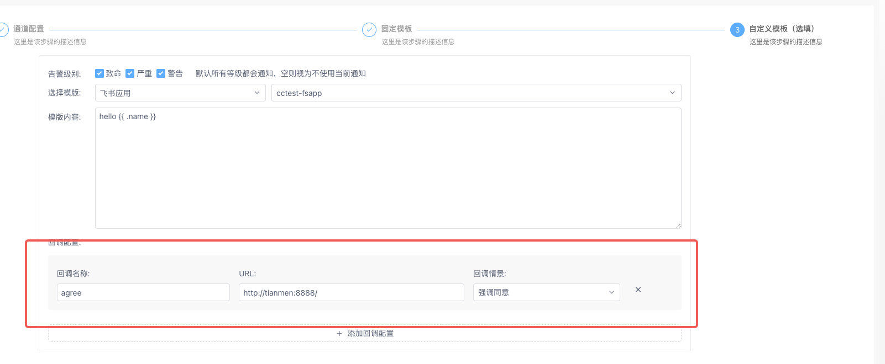
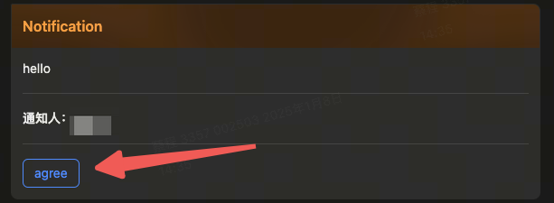
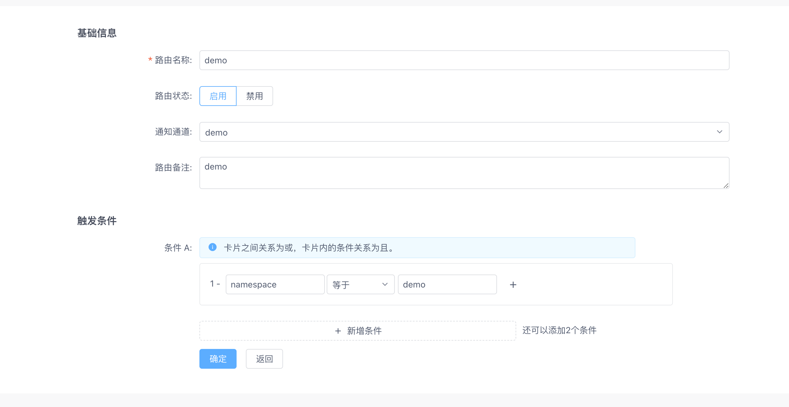

# 手把手教你玩转 一站式运维平台(CODO) - 7.使用通知中心完成高效率告警
## 项目结构



```text
.
├── docs
├── etc
├── internal
│   ├── biz
│   ├── conf
│   ├── dep
│   ├── ievents
│   ├── imiddleware
│   ├── impl
│   │   ├── alerts
│   │   └── data
│   │       └── models
│   ├── pkg
│   │   └── istr
│   ├── server
│   └── service
├── meta
├── pb
│   ├── channel
│   ├── healthy
│   ├── router
│   ├── templates
│   └── user
├── scripts
└── third_party
    ├── google
    │   ├── api
    │   └── protobuf
    │       └── compiler
    ├── khttp
    ├── openapi
    │   └── v3
    └── validate
```

## 术语解释

- 消息模板(无状态): 一个消息的模板定义, 负责定义渲染引擎 & 发出渠道
- 通知通道(有状态): 一组通知的集合, 在不同的通知级别中, 发向不同的 **消息模板**, 同时在这里配置 **消息模板** 的渠道方的配置(密钥等)
- 通知路由(有状态): 一个消息解析&路由器, 作为一个 http 回调端点, 对回调的内容进行解析, 并将消息路由到对应配置的 **通知通道**.
    - labels: 通知进行路由的数据依据, 从回调的 httpQuery 和 jsonBody 两处取值进行合并, 相同key 时, jsonBody 优先
    - data: 用于消息模板的数据渲染, 从 jsonBody 取值


## 快速入门

### 配置消息模板

在 消息模板 页签, 点击 创建, 即可进行配置.

模板用途 用于在配置通知通道时, 与对应的通道通途对应.

目前支持:

- 飞书机器人(飞书 webhook 机器人)
- 飞书应用(飞书bot 单聊)
- 钉钉机器人(钉钉 webhook 机器人)
- 钉钉应用(钉钉bot 单聊)
- 企业微信机器人(企业微信 webhook 机器人)
- 企业微信应用(企业微信bot 单聊)
- 阿里云短信
- 阿里云电话
- 腾讯云短信
- 腾讯云电话
- 邮件
- webhook



### 快速调试(飞书webhook机器人为例)

在填入 **模板内容** 之后, 点击 **保存** 之后, 可以对模板进行快速调试, 在 **地址** + **密钥** 上填入 **飞书webhook机器人** 的配置

关于添加自定义机器人, 可以查看: [飞书自定义机器人指南](https://open.feishu.cn/document/client-docs/bot-v3/add-custom-bot?lang=zh-CN)





### 配置通知通道

注意事项:

- 选中对应的 **通道用途** 之后, 后续只能选择 **对应通道用途** 的 **消息模板**
- **通知用户** 为默认通知用户, 可以在通知路由回调接口时, body 中传入 key 为 “noticer”, value 为 “英文逗号分隔的用户名”, 用于替换
- 默认提供两个固定模板(作为简单使用, 无需配置 **通知模板**), 如果不需要可以 告警级别设置为空(电话告警), webhook 设置为空(飞书机器人告警)

配置基础信息:



配置固定模板:



配置自定义模板:



#### 回调配置

还可以配置回调用于信息交互



展示



### 配置通知路由

注意:

- 通知路由地址: **网关地址/api/noc/v1/router-alert** ( 支持 POST | GET )
- http post 中的 jsonBody 会用作消息模板的数据渲染
- jsonBody 和 httpQuery 部份会一起作为 **labels数据** 进行通知路由匹配
- 如果 severity 为空, 则默认级别为 “警告”

特殊业务意义字段:

```golang
FieldsMessage     = "message"      // 通用消息字段 (从 jsonBody 取值)
FieldsManager     = "codo_manager" // 业务负责人 (从 httpQuery + jsonBody 取值)
FieldsNoticer     = "codo_noticer" // 内置通知人 (从 httpQuery + jsonBody 取值)
FieldsSeverity    = "severity"     // 告警等级 [fatal | error | warn | info] (从 httpQuery + jsonBody 取值)
FieldsTitle       = "title"        // 告警标题 (从 httpQuery + jsonBody 取值)
FieldsNativeTitle = "codo_title"   // 原生标题 不做其他处理 (从 httpQuery + jsonBody 取值)
FieldsStatus      = "status"       // 告警状态 [resolved | firing | resolving | inactive] (从 httpQuery + jsonBody 取值)
FieldsAppCn       = "cmdb_bizcn"   // 业务中文描述 (从 httpQuery + jsonBody 取值)
FieldsCallbackArgs = "codo_callback_args" // 回调参数, 只能是个字符串 (从 httpQuery + jsonBody 取值)
```

