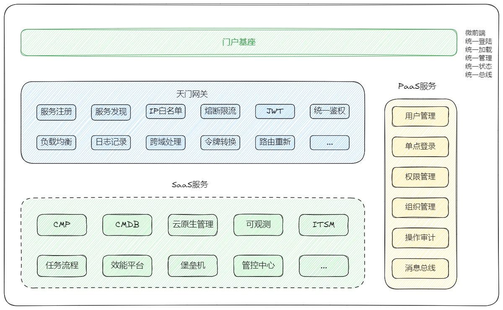

# OpenDevOps

<p align="center">
    <a href="http://www.opendevops.cn/">
        
    </a>
</p>

[](https://www.python.org/)
[](https://golang.google.cn/)
[](https://www.tornadoweb.org)
[](https://cn.vuejs.org)
[](https://ant-design.antgroup.com/)
[](https://www.iviewui.com/)
[](https://github.com/996icu/996.ICU/blob/master/LICENSE)

[](https://www.bilibili.com/video/BV1rp4y1v7fa/)

## 架构总图



----

## 项目介绍

CODO 是一款专为企业设计的开源全球一站式运维平台，支持多混合云环境和自动化运维，为企业提供跨地域、跨云的统一管理能力。

CODO前端基于 Vue + iView 和 React + Ant Design 开发，提供直观友好的操作界面，显著提升用户体验和工作效率。

CODO后端采用 Python Tornado 和 Golang Gin，具备轻量级、简洁清晰和异步非阻塞的特点，实现高并发和快速响应。

CODO微服务网关基于 OpenResty + Lua 开发，提供统一的 API 网关和服务治理能力，其优势在于高性能、灵活扩展和优秀的负载均衡支持。

CODO前端微服务基座构建于阿里 乾坤框架 之上，负责统一纳管前端应用，支持微前端架构，具备模块化管理、动态加载及高效集成的能力。

CODO集成了多种功能模块，支持跨地域和跨云环境的统一管理，帮助企业提升运维效率和系统可靠性。主要功能包括：

- 自动化运维：支持任务调度、批量操作和流程编排，提升工作效率。
- 实时观测与预警：提供跨地域、跨云的实时监控能力，保障系统稳定性。
- 配置管理：集中管理云资源配置，减少人为错误，提升合规性。
- 云原生管理：支持容器化与云原生技术，简化 Kubernetes 和微服务管理。
- 日志与审计：提供统一的日志存储、分析及审计能力，确保安全性与可追溯性。
- 安全管理：强化权限控制和访问管理，保障系统安全。
- 多云管理：整合多云环境，实现资源优化与高效管理。
  
通过集中化的管理界面和强大的自动化工具，CODO能够帮助企业快速检测与修复故障，优化资源使用并确保合规性，助力企业在全球范围内实现高效、可靠的IT运维管理，从而全面提升业务连续性和市场竞争力。

众多功能模块我们一直在不停的调研和开发，如果你对此项目感兴趣可以加入我们的社区QQ交流群：18252156

同时也希望你能给我们项目一个star，为贡献者加油⛽️！为运维干杯🍻！

----

## Microservice
```shell
codo
├── codo-admin # 管理后台
├── codo-agent-server # 底层管控
├── codo-cloud-agent-operator # 执行云原生任务
├── codo-cmdb # 数据资产、多云资源管理
├── codo-cnmp # 云原生管理平台
├── codo-flow-servers # 任务平台、作业调度执行
├── codo-monitor # 可观测平台
├── codo-notice #  通知中心
├── codo-frontend # 前端应用、流量入口(API流量 先进这里再路由到 gateway)
├── codo-gateway # API网关
└── codo-kerrigan # 配置中心
```

## 项目结构  

```
codo
├── codo-admin               # 管理后台  
├── codo-agent-server        # 底层管控  
├── codo-cloud-agent-operator # 执行云原生任务  
├── codo-cmdb                # 数据资产、多云资源管理  
├── codo-cnmp                # 云原生管理平台  
├── codo-flow-servers        # 任务平台、作业调度执行  
├── codo-monitor             # 可观测平台  
├── codo-notice              # 通知中心  
├── codo-frontend            # 前端应用、流量入口  
├── codo-gateway             # API网关  
└── codo-kerrigan            # 配置中心  
```

## 模块介绍  

1. [**codo-admin**](https://github.com/opendevops-cn/codo-admin/blob/main/README.md)  
   用于管理后台的操作平台，提供高效的管理界面和用户友好的操作体验。  

2. [**codo-agent-server**](https://github.com/opendevops-cn/codo-agent-server/blob/main/README.md)
   底层管控模块，负责与主机或环境进行通信，实现资源的统一管理。  

3. [**codo-cloud-agent-operator**](https://github.com/opendevops-cn/codo-agent-server/blob/main/README.md) 
   负责执行云原生相关任务，支持 Kubernetes 等容器化任务的操作和调度。  

4. [**codo-cmdb**](https://github.com/opendevops-cn/codo-cmdb/blob/main/README.md)  
   数据资产管理平台，提供多云资源管理、CMDB 数据整合及资产统一视图。  

5. [**codo-cnmp**](https://github.com/opendevops-cn/codo-cnmp/blob/main/README.md)  
   云原生管理平台，专注于容器化、微服务及 Kubernetes 集群的管理。  

6. [**codo-flow-servers**](https://github.com/opendevops-cn/codo-flow/blob/main/README.md)  
   任务平台模块，支持任务调度、流程管理及批量作业执行。  

7. [**codo-monitor**](https://github.com/opendevops-cn/codo-monitor/blob/main/README.md)  
   可观测平台模块，提供实时监控、预警和性能分析能力，保障系统稳定性。  

8. [**codo-notice**](https://github.com/opendevops-cn/codo-notice/blob/main/README.md)  
   通知中心模块，支持多渠道通知推送，实现高效的事件响应。  

9. [**codo-frontend**](https://github.com/opendevops-cn/codo-frontend/blob/main/README.md) 
   前端应用和流量入口模块，处理 API 流量并路由至网关，支持模块化前端开发。  

10. [**codo-gateway**](https://github.com/opendevops-cn/codo-gateway/blob/main/README.md) 
    API 网关模块，负责统一流量入口和服务治理，提供高性能路由与认证支持。  

11. [**codo-kerrigan**](https://github.com/opendevops-cn/codo-kerrigan/blob/main/README.md) 
    配置中心模块，用于集中管理配置项，实现动态配置更新和分布式配置下发。  

## Architecture

