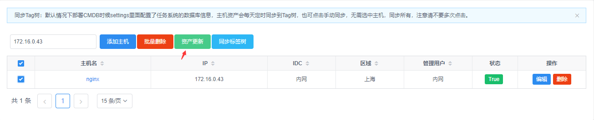
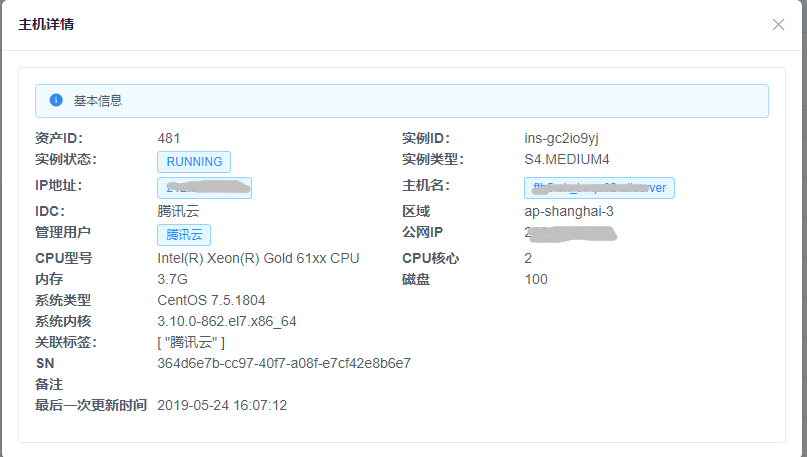
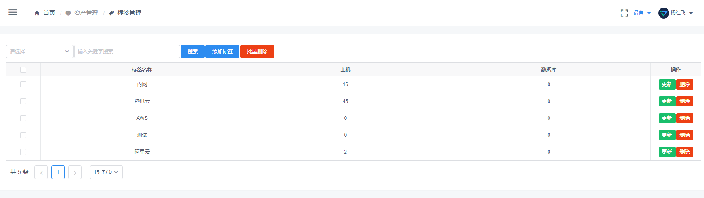

### 资产管理

> 这部分主要介绍CMDB资产管理一期，更多新功能正在开发中，现版本详细操作也可观看[视频示例](https://www.bilibili.com/video/av53408299/)

**添加主机**

- 管理用户： 例如AWS的`ec2-user`

- 其余字段不做多解释，从字面可以看出意思

**资产更新**

选择主机进行资产更新，这里为手动更新，默认系统会每天进行后台自动更新

**同步标签树**

不需要选中主机，同步标签树是一个和作业配置中标签树进行了打通，如果需要CMDB的数据同步到标签树里面则点击此按钮即可同步，同步后数据以CMDB为主，标签树里面多出来的则会被删除，谨慎操作。

**机器状态**

CMDB中的几种状态

- New：表示手动新增的机器
- Auto：表示自动从云厂商拉取过来的主机，这个时候主机详情的信息都是云上获取到的一些基础信息
- True：表示已经手动点了资产更新的操作，这时候资产信息都是从主机系统上脚本获取到的信息

- False：表示更新资产失败，这个状态下是可以查看错误日志的

**DB管理**

这里DB管理第一版只是简单的记录，没有规划很多功能，很多字段也是预留字段，后续会做成自动相关的

**标签管理**

取消了组的概念，Tag设计的出发点就是伪组，这里也是将机器分类

**管理用户**

- 将私钥放在平台上，平台是根据这个私钥去连接你的主机的，例如：AWS的`ec2-user`

**资产配置**

这一块主要用来用户给我配置一些Key信息，我去APi接口里面把机器给获取下来加到CMDB里面

自动拉取，后端日志统一在：` tailf /var/log/supervisor/cmdb_cron.log `

- 只有状态按钮为开启状态，系统才会去你配置的区域里面去拉取主机信息
- 请确保你填写的AccessID/AccessKey/Region区域信息的准确性，可点击测试按钮进行测试权限
- 最好能够确保你机器的Hostname是唯一值，CMDB设计中Hostname是不允许重复的，自动必然要有一些规范
-  默认管理用户：此用户是可以登陆机器的，若此处填写了默认管理用户，会自动给机器关联上此用户，用于后续资产更新连接使用，一般情况下管理用户一个账户里面OPS都是1-2个，毕竟太多OPS自己维护起来也很麻烦
- 自动获取来的机器状态都是Auto状态，若不配置管理用户，默认资产详情信息都是从云平台获取的一些基本信息，若配置了管理用户并更新了资产，资产信息来源基于系统本身获取到的
- `拉取资产按钮：手动触发云厂商主机更新到主机列表，默认情况下6小时会自动更新一次，请不要频繁点击，可能会产生调用接口费用(AWS)`
- 若此处配置了，系统会自动调用请求云厂商主机详情脚本(只要有查询实例的权限即可)，将指定区域的配置自动拉取并写入CMDB中,另外AWS测试可能需要5~10s不等，因为请求接口都在国外

