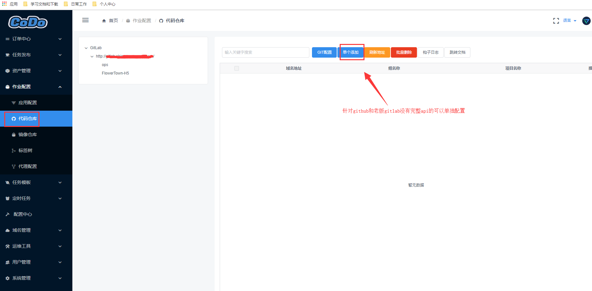

### 代码仓库

> 列举一个平台上代码仓库部分的示例，让大家快速灵活的使用OpenDevOps平台，进行对接代码仓库的实战操作；

**创建代码仓库**

点开`作业配置`-`代码仓库`-`GIT配置`

**填写对应git_url、[private_token](https://docs.gitlab.com/ee/user/profile/personal_access_tokens.html)、deploy_key**

- git_url： https://gitlab.domain.com/
- [private_token](https://docs.gitlab.com/ee/user/profile/personal_access_tokens.html): Gitlab申请的Access Token


- 添加保存后点击刷新地址，将同步所有该地址下的项目分支到平台


至此，Gitlab的仓库信息已经可以同步到平台上了，如果你需要基于Gitlab 钩子进行操作，你需要进行以下配置

- **Git服务器操作-->配置GitLab全局钩子**
- **CODO平台操作--->配置单个仓库钩子匹配规则**


**第一步、配置Gitlab全局钩子**

> 此步骤是监控GitLab所有提交事件，根据平台配置的钩子匹配规则进行触发你所定义的任务

注意：`由于Gitlab版本存在CE版本和源码安装版本，全局update钩子配置不同`

- GitlabCE版本路径：`/opt/gitlab/embedded/service/gitlab-shell/hooks`
- GitLab源码版本路径：`/home/git/gitlab-shell/hooks/`

此目录下的钩子都是为全局钩子，请慎重修改，本操作是不影响其余钩子/局部钩子的情况下添加的。

请修改`update`文件，在`ruby`脚本中修改成以下内容：

```ruby
#!/opt/gitlab/embedded/bin/ruby --disable-gems
# Fix the PATH so that gitlab-shell can find git-upload-pack and friends.
ENV['PATH'] = '/opt/gitlab/bin:/opt/gitlab/embedded/bin:' + ENV['PATH']

#!/usr/bin/env ruby

# This file was placed here by GitLab. It makes sure that your pushed commits
# will be processed properly.

ref_name  = ARGV[0]
old_value = ARGV[1]
new_value = ARGV[2]
repo_path = Dir.pwd
key_id    = ENV.delete('GL_ID')
#CODO TASK，只需要加下面2行即可
codo_task_script = '/opt/codo/codo-scripts/gitlab/codo_task.py'
system(codo_task_script, ref_name, old_value, new_value)

require_relative '../lib/gitlab_custom_hook'

if GitlabCustomHook.new(repo_path, key_id).update(ref_name, old_value, new_value)
  exit 0
else
  exit 1
end

```
示例图：


`/opt/codo/codo-scripts/gitlab/codo_task.py`脚本内容

注意： 一定要修改脚本中`accept_task_url` 、`git_url`、`auth_key`内容

```python
#!/usr/bin/env python
# -*- coding: utf-8 -*-
# @Time    : 2019/6/27 13:48
# @Author  : Fred Yangxiaofei
# @File    : codo_task.py
# @Role    : GitLab全局Hooks  update钩子


import sys
import os
import requests
import json


def post_codo_task():
    """
    监控全局钩子，CODO提交任务
    注意，Gitlab全局钩子调用此脚本的时候不能使用format
    :return:
    """
    # 修改你的钩子任务API接口
    accept_task_url = 'https://codo.opendevops.com/api/task/other/v1/git/hooks/'
    # 修改你的GIT地址
    git_url = 'http://gitlab.domain.com/'
    # 修改你的长期Token，从管理员获取， 此用户的Token需要对/task/other/v1/git/hooks/接口有权限
    auth_key = "eyJ0eXAiOiJeHAiOjE2NTY1NzgwOTUsIm5iZiI6MTU1Mjg5ODA3Nh"

    try:
        tag_name = sys.argv[1].split("/")[-1]  # tag/branch 名字
        repo_group = os.getcwd().split('/')[-2]  # 组名字
        repo_name = os.getcwd().split('/')[-1].replace('.git', '')  # git名字
        relative_path = repo_group + '/' + repo_name  # 组+git名字路径

        the_body = json.dumps({
            "git_url": git_url,
            "relative_path": relative_path,
            "tag_name": tag_name
        })

        req1 = requests.get(accept_task_url, cookies=dict(auth_key=auth_key))
        csrf_key = json.loads(req1.text)['csrf_key']
        cookies = dict(auth_key=auth_key, csrf_key=csrf_key)
        req = requests.post(accept_task_url, data=the_body, cookies=cookies)
        req_dict = json.loads(req.text)
        print('Hooks Log: ', req_dict.get('msg'))
    except Exception as e:
        print(e)


if __name__ == '__main__':
    post_codo_task()

```


**第二步、CODO平台配置钩子规则**

> 针对单个项目进行配置钩子规则，当你打Tag/brach中提交的的时候，根据你的匹配规则，正则匹配、来触发你所定义的任务


- 选择其中一个项目，点击对应的编辑按钮


- 提交测试钩子会在订单中心生成一个新订单，说明平台通道已经配置好


- 根据不同版本的gitlab有不同配置方式，老版本的gitlab由于API不完善，可以单独进行添加




- 都配置好之后可以自己打一个测试的tag进行测试

示例命令：

```shell
#基于branch
git touch test
git add --all
git commit -m "test"
git push -u origin master

#基于tag
git tag release-ftqqminigame-test01
git push -u origin release-ftqqminigame-test01

```

**平台查看钩子日志**  


**注意**

- 填写的git仓库域名地址和对应参数必须真实有效，否则测试不通过将不会保存