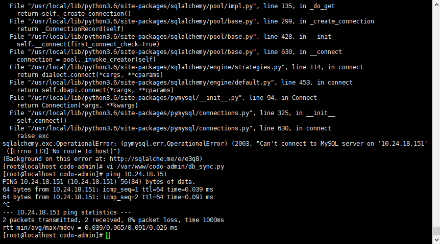

## FAQ

### 邮箱设置问题

> 由于常见的Email有很多，这里列举下最常见的Email设置

- Q: QQ邮箱怎么设置？
- A: QQ邮箱主要注意使用网页生成授权码进行作为密码登陆
    - [SMTP地址](https://service.mail.qq.com/cgi-bin/help?id=28&no=167&subtype=1)：smtp.qq.com
    - SMTP端口：465
    - SSL加密：True, 开启
    - 用   户: <your_qq>@qq.com
    - 密   码： 授权码（一般为16位）


- Q: 腾讯企业邮箱如何设置？
- A: 腾讯企业邮箱同QQ邮箱，唯一一点SMTP服务器不同
    - [SMTP地址](https://service.exmail.qq.com/cgi-bin/help?subtype=1&id=28&no=1000585)：smtp.exmail.qq.com
    - SMTP端口：465
    - SSL加密：True, 开启
    - 用   户: <your_name>@domain.com
    - 密   码： 授权码（一般为16位）


- Q: 网易163邮箱如何设置？
- A: 同上，唯一一点SMTP服务器不同
    - [SMTP地址](http://help.163.com/09/1223/14/5R7P3QI100753VB8.html)：smtp.163.com
    - SMTP端口：465
    - SSL加密：True, 开启
    - 用   户: <your_name>@163.com
    - 密   码： 授权码（一般为16位）


- Q: Gmail邮箱如何设置？
- A: Gmail邮箱考虑到安全，需要注意以下2步
  -  首先开启Google 二步认证
  -  [生成Google 应用专用密码](https://support.google.com/mail/answer/185833?hl=zh-Hans)
  - [SMTP地址](https://support.google.com/mail/answer/7126229?hl=zh-Hans&visit_id=636771670247559816-1235179449&rd=2)：smtp.gmail.com
  - SMTP端口：465
  - SSL加密：True, 开启
  - 用   户: <your_name>@gmail.com
  - 密   码： 授权码（一般为16位）


### Docker Bulid 报错问题

- 安装依赖报错：`Could not install packages due to an EnvironmentError'`

```
错误信息：
Step 10/16 : RUN pip3 install --upgrade pip
---> Running in 83716c526776

Collecting pip
Downloading https://files.pythonhosted.org/packages/c2/d7/90f34cb0d83a6c5631cf71dfe64cc1054598c843a92b400e55675cc2ac37/pip-18.1-py2.py3-none-any.whl (1.3MB)
Installing collected packages: pip
Found existing installation: pip 10.0.1
Uninstalling pip-10.0.1:
Successfully uninstalled pip-10.0.1
Could not install packages due to an EnvironmentError: [Errno 2] No such file or directory: '/tmp/pip-uninstall-y8n2hlf9/usr/local/bin/pip3'

The command '/bin/sh -c pip3 install --upgrade pip' returned a non-zero code: 1
```
- 解决办法：
```shell

Python3x版本后Docker里面需要加入--user的参数，修改Dockerfile, 加上--user参数， 如：pip3 install --user --upgrade pip
```

### 常见的错误码error code排错思路

- 404：  一般都是自己修改了域名或者配置错误，导致网关转发的时候没办法找到
- 500：  每个模块服务的后端报错，具体可参看报错模块日志： /var/log/supervisor/
- 502：  502错误是网关配置错误，请仔细检查网关配置和DNS配置，确保域名正常解析，且能访问。


### Google Authenticator怎么使用?
> 安全一定是最重要的，相信很多人都知道谷歌身份验证器，这里简单说下Google身份验证器怎么使用, 本平台Google验证码密钥是发送到用户邮箱的。

**下载谷歌验证器**
- iOS用户登录AppStore搜索"Authenticator"
- 安卓用户登录应用商店或利用手机浏览器搜索“谷歌验证器”下载,也可[点击下载](https://www.wandoujia.com/apps/com.google.android.apps.authenticator2)

**添加所需网站验证码**

`PS 由于国内Android多数都被阉割了Google框架，不能扫码的输入手动贴入密钥`

- 扫描条形码  


- 手动输入密钥  


**手机丢失怎么办**

1. 你可以搜索你之前的邮件记录，或者自行记录保存下来
2. 对于CODO超级管理员可以登陆数据库自行查看，SQL语法：`select google_key from codo_admin.mg_users where username='codo_test';`

### Login界面/登陆后一直自动刷新/闪屏/退出？

Q：可以登陆进去，但是一直闪屏刷新/退出？
  
A：出现这个问题是因为网关`token_secret`和`codo-admin`里面`token_secret`配置不一样，改成一样即可。
请仔细阅读网关配置中的[注册API网关文件](http://docs.opendevops.cn/zh/latest/codo-gw.html ) `configs.lua`这块

  
### Docker内部的MySQL、Redis无法连接问题  

> 有些同学发现在Docker内部无法连接到外面的MySQL，如下报错，一般都是防火墙引起的，防火墙不能关闭，因为NAT在用，清空掉Filter链 `iptables -F`或者添加上3306端口尝试下。  




### 新部署的系统无法创建User？没办法看到创建/重置/获取Token？  

Q：新部署的时候登陆进去，点击用户列表没办法创建/看不到重置密码/重置MFA按钮等问题？ 

A：这个问题是因为没有创建角色，默认部署的时候权限/组件数据都是初始化进去的，但是角色需要用户自己创建，用户可以点击**用户管理**-->**角色管理**  新建一个角色，给所有组件/菜单/权限  然后退出，强刷下浏览器就可以了  

操作步骤可参考：http://docs.opendevops.cn/zh/latest/permission_docs.html#role
  
