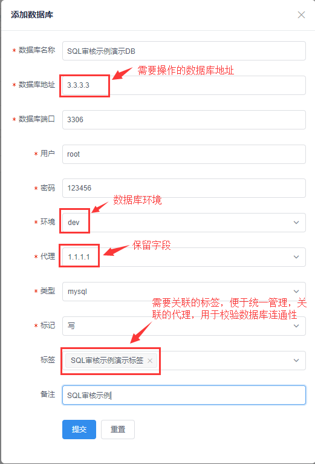
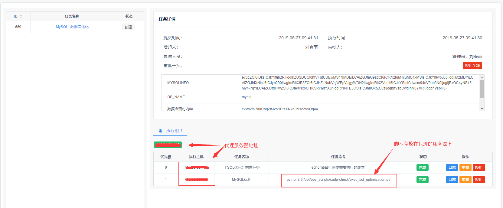

### 基于任务平台实现SQL优化示例

> 列举一个平台上任务发布里面SQL优化部分的实例，让大家快速灵活的使用OpenDevOps平台，进行实战操作；

`**创建一个需要操作的数据库标签**`

**新建标签**

点开`作业配置`-`标签树`-`root`-`新建标签`

- 具体字段参数含义详见`使用文档`--`作业配置`--`标签树`

**注意**
>授权用户：只有授权过的用户，在创建任务发布时才有权限对该标签操作

**代理配置**

>预先配置好代理服务器地址，用于创建标签树下DB时可供选取，该代理是用来连接无外网状态下的数据库而存在的。

- 具体字段参数含义详见`使用文档`--`作业配置`--`代理配置`

**新建DB**

> 点开`作业配置`-`标签树`-`DB`-`添加数据库`

- 具体字段参数含义详见`使用文档`--`作业配置`--`标签树`

**创建一个SQL优化任务发布**

点开`任务发布`--`SQL优化`

**注意**

- 截图右侧查询结果是在自动创建订单结束后回显得到的，生成的订单是自动执行，无需其他操作

**会在任务列表自动创建一个订单**

>点开`订单中心`--`订单列表`

