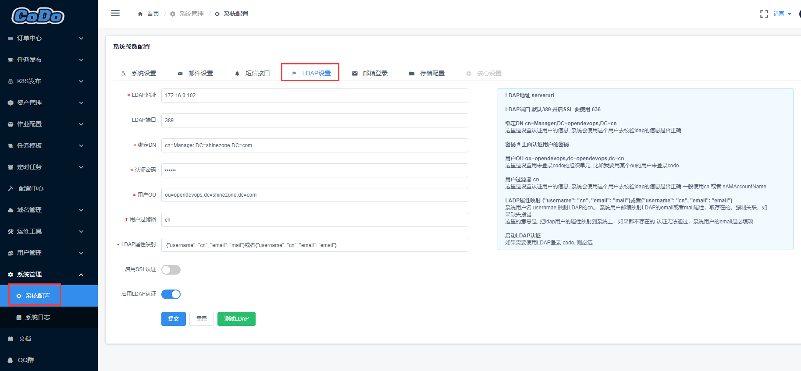

### 系统管理

> 这部分主要介绍系统配置，系统管理模块主要分为：`系统配置`和`系统日志`

**系统配置**
> 系统配置主要介绍系统参数配置，后续后陆续支持各种核心功能配置

**系统配置**
> 这块需要配置你的API地址，部署时你API网关服务所部署的服务器地址，只有确认了API网关，各个功能模块才可以正常通信。

- API地址: 你的API网关地址，可以是IP/域名，必填项。 [API网关部署](http://docs.opendevops.cn/zh/latest/step_by_step_install.html#api)

**邮件设置**

> 这块主要配置邮箱，配置了此邮箱信息后，后续平台内所涉及到邮件提醒都会使用此邮箱配置。

不同运营商配置可参考`FAQ`中[邮箱设置问题](http://docs.opendevops.cn/zh/latest/faq.html#)

- SMTP主题： 邮件标题
- SMTP主机： 服务器地址
- SMTP端口： 服务器端口
- SMTP账户： 邮箱账户名
- SMTP密码： 邮箱账户密码
- 如果SMTP端口是465，通常需要启用SSL
- 如果SMTP端口是587，通常需要启用TLS
- 点击测试邮件会给当前用户发送一封邮件用于测试

**短信接口**
> 这块主要配置短信接口信息，短信接口只支持阿里云`阿里大鱼`，后续平台所涉及到发短信会调用此接口

- 短信区域： `cn-hangzhou` 目前阿里官方给出必须是这个
- API名称： `Dysmsapi` 目前官方给出一般都是这个名称
- API域名：`dysmsapi.aliyuncs.com` 目前官方给出必须是这个地址
- KEY_ID： 你的IAM访问控制密钥ID
- KEY_SECRET： 你的access_secret密钥，备注：`这里需要必须有SMS的权限`
- 点击测试端口系统会向阿里大鱼进行发送查询接口，如果配置验证不通过则提示报错信息

**LDAP设置**

>这块主要用于配置LDAP认证

实例图如下：

​    

**邮箱登陆**
> 这块主要是支持第三方邮箱登陆，当你想要使用邮箱登陆此平台时，你可以在此进行配置
比如我们企业邮箱是腾讯的,域名就是`opendevops.cn`，SMTP就是腾讯的`stmp.exmail.qq.com`,这样配置完成后我就可以使用我`yanghongfei@opendevops.cn`邮箱+密码登陆此平台了。

- 邮箱SMTP： 这里输入你邮箱服务商的SMTP地址
- 邮箱域名：这里是你的邮箱后缀名字

**存储配置**

> 这块主要是配置Bucket信息，目前只支持阿里云的OSS，这里目前主要用于将跳板日志审计的内容存放到OSS目录里面，若不配置此项则存本地数据库（可能会很大，建议配置OSS)
- 区域Region：阿里云的可用区域，如：`cn-hangzhou`
- 存储桶名称: Bucket名称
- SecretID: 密钥ID，需要有OSS权限
- Secret Key： 密钥Key，需要有OSS权限

**系统日志**
> 这里主要记录的本系统平台的所有请求日志，如：GET/POST/DELETE/PUT等，你的操作信息都会被记录，不要随意干坏事哟，管理员都可以看到的，安全我们还是会考虑进去的。

最后，感谢你的支持，我们正在不断完善文档和平台功能，你也可以加入我们的的社区交流群进行反馈信息，给我们带来你的意见和建议。