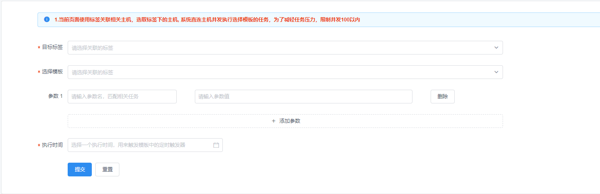

### 任务发布

> 这部分主要介绍代码发布的配置和一些SQL相关配置(更新中)，任务发布后续将会支持更多业务模块，目前以任务发布和SQL优化审核相关的配置为主；

**操作教学视频**：[https://www.bilibili.com/video/av53424572/](https://www.bilibili.com/video/av53424572/ ) 

**应用发布**

>该模块是任务发布主要功能，预先配置你代码发布的相关信息，设定时间自动执行。

例举例一个简单发布示例：

>请选择你要发布的应用，具体配置参考【作业配置】-【应用配置】。发布权限关联代码仓库权限【作业配置】-【代码仓库】。

**创建应用发布**

点开`应用发布`

- 选择应用：下拉选择在作业配置中配置的应用配置
- 标签版本：输入你的TAG
- 自定义参数：前面定义参数，后面填写对应值(例如：[IP] [203.167.11.100] )
- 开始时间：选择一个执行时间，来触发模板中的定时触发器
- 备注详情：填写你发布应用的标识


**SQL审核**

>该模块用来将要执行的SQl语句的提交给审批人进行审批，审批通过后才会在指定时间执行该SQL语句

**注意**
- 1.当前页面使用标签关联相关数据库，选取标签下的mysql的写库
- 2.本服务多部署在内网，为了适配多云多区域，需要经过代理连接数据库，标签里面应配置代理主机，当前任务会跳转到代理主机执行数据库审核
- 3.请使用标准的SQL语句，从语句上选择数据库。
- 4.使用内建模板ID：9001主机组为1在没有熟悉模板的使用之前，不要随意更改相关任务模板

点开`SQL审核`

- 目标标签：下拉选择你要关联的标签组
- SQL语句：填写要执行的SQL语句
- 审批人员：下拉选择你要提交审核的用户


**SQL优化**

>该模块用于优化SQL语句，输入要执行的SQL语句然后进行平分和优化等操作

**注意**

- 1.当前页面使用标签关联相关数据库，选取标签下的mysql,SQL优化使用内建模板ID：9901主机组为1，在没有熟悉模板的使用之前，不要随意更改相关任务模板
- 2.本服务多部署在内网，为了适配多云多区域，需要经过代理连接数据库，标签信息里面应配置代理主机，当前任务会跳转到代理主机执行

点开`SQL优化`

- 目标标签：下拉选择你要关联的标签组(注意:目标库只能选择一个数据库)
- 数据库名：输入要操作的数据库名称
- 优化类型：选择优化类型`SOAR`或`SQLAdvisor`
- SQL语句：填写要优化的SQL语句
- 操作： 选择你要操作的选项`SQL评分`,`SQL指纹`,`SQL美化`,`语法检查`


**资源申购**

>该模块用于申购服务器，数据库，Redis，负载均衡等资源使用(更新中)

**节点添加**

>用于横向扩展Kubernetes(K8S)节点(更新中)

**自定义任务**

>该模块可以更灵活的添加自己要对服务器操作的任务模板

**注意**
- 1.当前页面使用标签关联相关主机，选取标签下的主机, 系统直连主机并发执行选择模板的任务，为了减轻任务压力，限制并发100以内

点开`自定义任务`

- 目标标签：下拉选择自定义的标签组
- 选择模板：下拉选择自定义的模板
- 参数1：填写上传的参数和对应参数值(可增加和删除参数选项)
- 执行时间：选择一个执行时间，用来触发模板中的定时触发器



**自定义任务-代理**

>该模块用于处理无法直连服务器需要通过代理连接来执行一些任务

**注意**
- 1.当前页面使用标签关联相关主机，选取标签下的主机,在代理主机上执行选择模板的任务，并把主机名，IP地址传给任务，任务本身通过ansible、saltsatck、多线程、多进程等方法来进行并发。参数IP：SERVER_IP,主机名：SERVER_HOST一般可以作为salt name。

点开`自定义任务-代理`

- 目标标签：下拉选择自定义的标签组(注意：标签可以多选，但是代理主机有且仅有一个，不可多选)
- 选择模板：下拉选择自定义的模板
- 参数：填写上传的参数和对应参数值(可增加和删除参数选项)
- 执行时间：选择一个执行时间，用来触发模板中的定时触发


**自定义任务-JSON**

>该模块提供了自定义JSON的方式更方便灵活的来进行自定义任务

**注意：参数详解**
```json


{
	"task_name": "任务名称",
	"submitter": "提交人",
	"temp_id": "1",
	"schedule": "ready",
	"exec_time": "2018-11-27 14:09:50",
	"associated_user": "{'group-1': ['杨红飞']}",
	"args": "{'VERSION':'eeee', 'arg02': 'xxxx'}",
	"details": "这里是备注",
	"hosts": "{1: '127.0.0.1'}"
}


```

- 1.task_name: 任务名字
- 2.submitter: 提交人
- 3.temp_id：模板ID，就是你上面创建模板时候生成的那个ID
- 4.schedule：这是状态，常用的有ready和new ready：表示不通过人工审核，只要到了执行时间直接执行任务new：表示需要任何审核，管理员审核，选择执行时间，到时间后开始执行
- 5.exec_time： 任务执行时间，状态为ready的情况下，到这个时间会进行执行
- 6.args：这里是一个字典，里面的参数可以自行定义，如上，你模板参数里面用到了哪些你都可以在这里定义出来，当你的POST到这个接口时候，我们会自动接受此参数，并帮你运行脚本 解析你要传入的参数。
- 7.details：描述，备注信息
- 8.hosts：这个是执行主机，字典形式， 1表示第一组主机，也就是上面模板里面的组1，任务支持多组。主机IP，这个是执行主机，这个废话多一点，比如我以上模板的脚本在172.16.0.101这台主机上，我就想平台登陆我这个主机，来帮我执行这些脚本，至于怎么登陆，那么就是我最开始在平台里面配置了一个执行用户，我将我这个主机的私钥放到了平台上，公钥在我服务器上，这样子CODO平台就可以ssh -i xxxx.pem@{ip_address}远程到我的主机上帮我执行命令。

点开`自定义任务-JSON`

- POST JSON：输入你的数据，参考上面的示例，你也可以二次开发对接自己的CMDB获取主机，时间字段从下面获取，方便处理(注意：提交的数据必须以JSON格式，请严格按照说明提交)
- 执行时间：选择一个执行时间，用来触发模板中的定时触发


PS：已经文档会在后续过程中不断更新完善，感谢大家支持。
